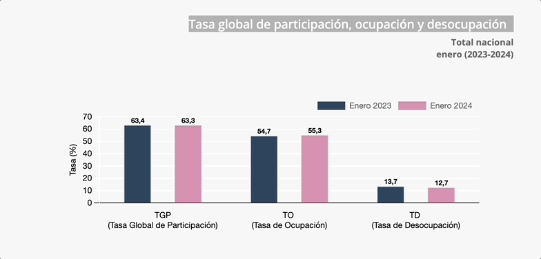
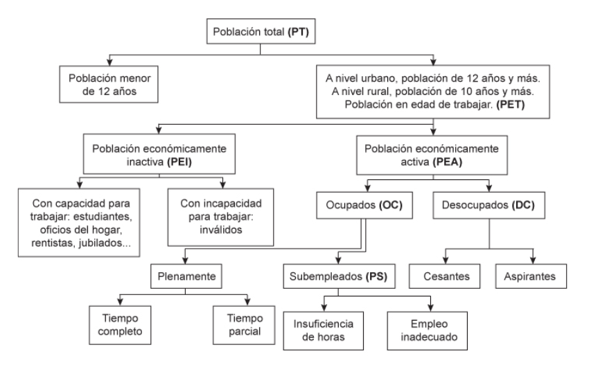

```{r setup}
#| include: false
library(pacman)
p_load(tidyverse, scales, gapminder, ggiraph, patchwork, kableExtra, TSstudio, fontawesome, readxl, ggthemes, xaringanExtra, ggdag, viridis, knitr, dslabs, gapminder, extrafont, Ecdat, tidyverse, magrittr, janitor, kableExtra)
# Colores
red_pink <- "#e64173"
met_slate <- "#272822" # metropolis font color 
purple <- "#9370DB"
green <- "#007935"
light_green <- "#7DBA97"
orange <- "#FD5F00"
turquoise <- "#44C1C4"
# knitr options
opts_chunk$set(
  comment = "#>",
  fig.align = "center",
  fig.height = 7,
  fig.width = 10.5,
  #dpi = 300,
  #cache = T,
  warning = F,
  message = F
)  
theme_simple <- theme_bw() + theme(
  axis.line = element_line(color = met_slate),
  panel.grid = element_blank(),
  rect = element_blank(),
  strip.text = element_blank(),
  text = element_text(family = "Fira Sans", color = met_slate, size = 17),
  axis.text.x = element_text(size = 12),
  axis.text.y = element_text(size = 12),
  axis.ticks = element_blank()
)
theme_market <- theme_bw() + theme(
  axis.line = element_line(color = met_slate),
  panel.grid = element_blank(),
  rect = element_blank(),
  strip.text = element_blank(),
  text = element_text(family = "Fira Sans", color = met_slate, size = 17),
  axis.title.x = element_text(hjust = 1, size = 17),
  axis.title.y = element_text(hjust = 1, angle = 0, size = 17),
  # axis.text.x = element_text(size = 12),
  # axis.text.y = element_text(size = 12),
  axis.ticks = element_blank()
)
theme_gif <- theme_bw() + theme(
  axis.line = element_line(color = met_slate),
  panel.grid = element_blank(),
  rect = element_blank(),
  text = element_text(family = "Fira Sans", color = met_slate, size = 17),
  axis.text.x = element_text(size = 12),
  axis.text.y = element_text(size = 12),
  axis.ticks = element_blank()
)
wrapper <- function(x, ...) paste(strwrap(x, ...), collapse = "\n")
shift_axis <- function(p, y=0){
  g <- ggplotGrob(p)
  dummy <- data.frame(y=y)
  ax <- g[["grobs"]][g$layout$name == "axis-b"][[1]]
  p + annotation_custom(grid::grobTree(ax, vp = grid::viewport(y=1, height=sum(ax$height))), 
                        ymax=y, ymin=y) +
    geom_hline(aes(yintercept=y), data = dummy, size = 0.5, color = met_slate) +
    theme(axis.text.x = element_blank(), 
          axis.ticks.x = element_blank())
}
#xaringanExtra::use_scribble()

# budget line (for graphing)
budget <- function(x, wage, non_labor_income) {
  wage * (24 - x) + non_labor_income
}

# utility function = u(x, y) = C (x - A)^a (y - B)^(1-a)
utility <- function(x, y, constant = 1, alpha = 0.5, offset = 10) {
  if (offset == 0) {
    utility <- constant * (x ^ alpha) * (y ^ (1 - alpha))
  } else {
    utility <-
      constant * ((x - 1 / offset) ^ alpha) * ((y - 1 / offset) ^ (1 - alpha))
  }
  return(utility)
}

# optimal leisure hours
optimize <-
  function(non_labor_income = 0,
           wage = 4,
           alpha = 0.5,
           offset = 10) {
    if (offset == 0) {
      marginal_utility <-
        function(x) {
          ((1 - alpha) / alpha) * wage * x
        }
    } else {
      marginal_utility <- function(x) {
        (offset * x * wage + wage - alpha * (offset * x * wage + wage + 1)) / (offset * alpha)
      }
    }
    
    budget <- function(x) {
      wage * (24 - x) + non_labor_income
    }
    
    optimal_x <-
      uniroot(function(x)
        budget(x) - marginal_utility(x), c(-100, 100))$root
    
    if (optimal_x > 24) {
      optimal_x <- 24
    }
    
    return(optimal_x)
  }

# indifference curve (k = utility level)
ic <- function(x, k, constant = 1, alpha = 0.5, offset = 10) {
  if (offset == 0) {
    ic <- (k / (constant * x ^ alpha)) ^ (1 / (1 - alpha))
  } else {
    ic <- ((k * (x - 1/offset) ^ (-alpha)) / constant) ^ (1 / (1 - alpha)) + 1/offset
  }
  return(ic)
}

# not accurate enough for offset != 0
ic_slope <- function(x, k, constant = 1, alpha = 0.5, offset = 10) {
  if (offset == 0) {
    ic_slope <- alpha * ((k * x ^ (-alpha)) / constant) ^ (1 / (1 - alpha)) / ((alpha - 1) * x)
  } else {
    ic_slope <- alpha * offset * ((k * (x - 1/offset) ^ (-alpha)) / constant) ^ (1 / (1 - alpha)) / ((alpha - 1) * (offset * x - 1))
  }
  return(ic_slope)
}

```

## Lo que vamos a ver

- En esta parte del curso se mostrará las implicaciones del [Desempleo]{.oranger} en la Economía.
- Se clasifica la estructura de desempleo en una economía.
- ¿Qué determina al desempleo?.
- Entender su dinámica.

## Concepto

::: fragment
::: callout-note
## Desempleo
Se refiere a la situación en la cual un trabajador quien tiene disposición a trabajar no consigue quien lo emplee.
:::
:::

- En los mercados de trabajo (laborales), la [demanda]{.under} la conforman las [empresas]{.bg style="--col: #FFFF00"}, puesto que requieren de habilidades o mano de obra que le ofrecemos los seres humanos que hacemos parte de la fuerza laboral.

- [P:]{.blut} Por qué necesitamos trabajar?
- [R./1]{.alert} Las cuentas (*deudas*) no se pagan solas.
- [R./2]{.alert} Tener dinero para comprar y satisfacer **necesidades** 

## Mercado laboral

::::{.columns}
::: {.column width="60%"}
```{r, echo = FALSE, fig.height = 5.5, fig.width = 5.5, dev = "svg"}
supply <- function(x) 1 + (4/5)*x

ggplot(data = data.frame(x = 0), mapping = aes(x = x)) +
  scale_x_continuous(limits = c(0, 10.5), expand = c(0, 0), breaks = seq(0, 10, 1)) +
  scale_y_continuous(limits = c(0, 10.5), expand = c(0, 0), breaks = seq(0, 10, 1)) +
  theme_market +
  labs(x = "L", y = "w") +
  stat_function(fun = supply, color = red_pink, size = 1) +
  annotate("label", label = "S", x = 9, y = supply(9), color = red_pink, family = "Fira Sans", size = 5)
```
:::

::: {.column width="40%"}
- La oferta aumenta $\uparrow$ en la medida que $w$ (Wages) Salarios lo hacen
- Los trabajadores estarán [mas dispuestos]{.bg style="--col: #00FFFF"} a trabajar en la medida que la remuneración es [mayor]{.alert}
:::
::::

## Mercado laboral
::::{.columns}
::: {.column width="60%"}
```{r, echo = FALSE, fig.height = 5.5, fig.width = 5.5, dev = "svg"}
demand <- function(x) 10 - x

ggplot(data = data.frame(x = 0), mapping = aes(x = x)) +
  scale_x_continuous(limits = c(0, 10.5), expand = c(0, 0), breaks = seq(0, 10, 1)) +
  scale_y_continuous(limits = c(0, 10.5), expand = c(0, 0), breaks = seq(0, 10, 1)) +
  theme_market +
  labs(x = "L", y = "w") +
  stat_function(fun = demand, color = purple, size = 1) +
  annotate("label", label = "D", x = 9, y = demand(9), color = purple, family = "Fira Sans", size = 5)
```
:::

::: {.column width="40%"}
- La demanda compuesta por [empresas]{.oranger} espera contratar a un menor precio $(w)$ a los trabajadores
- En la medida que el salario $\downarrow$ hay un mayor número de empleos por ofrecer. 
:::
::::

## Mercado laboral

::::{.columns}
::: {.column width="60%"}
```{r, echo = FALSE, fig.height = 5.5, fig.width = 5.5, dev = "svg"}
market <- ggplot(data = data.frame(x = 0), mapping = aes(x = x)) +
  scale_x_continuous(limits = c(0, 10.5), expand = c(0, 0), breaks = seq(0, 10, 1)) +
  scale_y_continuous(limits = c(0, 10.5), expand = c(0, 0), breaks = seq(0, 10, 1)) +
  theme_market +
  labs(x = "L", y = "w") +
  stat_function(fun = supply, color = red_pink, size = 1) +
  annotate("label", label = "S", x = 9, y = supply(9), color = red_pink, family = "Fira Sans", size = 5) +
  stat_function(fun = demand, color = purple, size = 1) +
  annotate("label", label = "D", x = 9, y = demand(9), color = purple, family = "Fira Sans", size = 5)
market
```
:::

::: {.column width="40%"}
- En [Equilibrio]{.bg style="--col:  #e64173"} la cantidad de trabajo demandada es **igual** a la ofrecida, algo como $L_S=L_D$.
- En ese punto los actores del mercado quedan satisfechos.
:::
::::

## Mercado laboral

::::{.columns}
::: {.column width="60%"}
```{r, echo = FALSE, fig.height = 5.5, fig.width = 5.5, dev = "svg"}
market + 
  geom_point(aes(x = 5, y = 5), color = met_slate, size = 2) +
  geom_segment(aes(x = 5, y = 0, xend = 5, yend = 5), linetype  = "dashed", color = met_slate) + 
  geom_segment(aes(x = 0, y = 5, xend = 5, yend = 5), linetype  = "dashed", color = met_slate)
```
:::

::: {.column width="40%"}
- El ajuste por las fuerzas de demanda y oferta se da vía [conciliación/contrato]{.under}. 
- Dependiendo de los [eventos]{.alert}, tendremos mas fuerza por un lado que por el otro. Sin embargo se sigue dando negociación
:::
::::

## Mercado laboral

::::{.columns}
::: {.column width="60%"}
```{r, echo = FALSE, fig.height = 5.5, fig.width = 5.5, dev = "svg"}
market + geom_hline(yintercept = 3, linetype  = "dashed", color = met_slate) 
```
:::

::: {.column width="40%"}
- Algunas ocasiones tendremos [escasez]{.alert} de mano de obra, por ende habrá algún [desequilibrio]{.under} dentro del mercado.
- Esto genera que los salarios entonces sean mas altos. P.e (Ucrania)
:::
::::

## Mercado laboral

::::{.columns}
::: {.column width="60%"}
```{r, echo = FALSE, fig.height = 5.5, fig.width = 5.5, dev = "svg"}
market + geom_hline(yintercept = 3, linetype  = "dashed", color = met_slate) +
  geom_segment(aes(x = 7, y = 0, xend = 7, yend = 3), linetype  = "dashed", color = met_slate) + 
  geom_point(aes(x = 7, y = 3), color = met_slate, size = 2) +
  geom_segment(aes(x = 2.5, y = 0, xend = 2.5, yend = 3), linetype  = "dashed", color = met_slate) + 
  geom_point(aes(x = 2.5, y = 3), color = met_slate, size = 2)
```
:::

::: {.column width="40%"}
- Cuando esto ocurre se da que $L_D>L_S$. 
- Si en Colombia no tuviéramos demasiada [fuerza laboral]{.under} quizás los salarios fueran mas altos
:::
::::

## Mercado laboral

::::{.columns}
::: {.column width="60%"}
```{r, echo = FALSE, fig.height = 5.5, fig.width = 5.5, dev = "svg"}
market + geom_hline(yintercept = 7, linetype  = "dashed", color = met_slate) 
```
:::

::: {.column width="40%"}
- Mire ahora lo del [Desempleo]{.oranger} 
- Es cuando $L_D<L_S$,
- Tenemos mas personas dispuestas a trabajar mas pero menos demanda de ciertas ocupaciones especificas.
- No sabemos si las maquinas inclusive puedan reemplazarnos.
:::
::::

## Mercado laboral

### Definiciones

- $E=$ número de personas empleadas

- $D=$ número de desempleados

:::fragment
::: callout-tip
Estar "en desempleo" significa 1) desear un empleo y 2) estar buscando trabajo activamente.
:::
:::

- $P=$ población de interés (por ejemplo, residentes en Colombia entre 24 y 64 años)

- Población Económicamente activa $PEA=$ número total de individuos que desean un empleo

## Mercado laboral

### Definiciones

::: fragment
::: callout-note
Fuerza laboral = E + D
:::
:::

::: fragment
> Definimos entonces la tasa global de participación
:::

::: fragment
$$TGP=\dfrac{\text{Fuerza Laboral}}{\text{Población}} \times 100$$
:::

## Mercado laboral

:::fragment

:::

##  {background-image="images/arb.jpg"}

### Desempleo {.r-fit-text}

## Desempleo

:::fragment
> La tasa de desempleo es el número de desempleados que tiene la economia dividida sobre su fuerza laboral.
:::

- La tasa de desempleo viene a ser en formula

::: fragment
$$\text{Tasa de desempleo}=\dfrac{\text{Desempleados}}{\text{PEA}}$$
:::

- La PEA o **Población Económicamente Activa** depende de:

    - No incluye a los trabajadores desanimados que desean un empleo pero han dejado de buscarlo.
    - No incluye a los trabajadores subempleados que trabajan a tiempo parcial, pero desean trabajar a tiempo completo.
    
## Desempleo

::: fragment
<iframe src="https://ourworldindata.org/grapher/unemployment-rate?tab=chart" loading="lazy" style="width: 100%; height: 600px; border: 0px none;"></iframe>
:::

## Desempleo

:::fragment
```{r unemployment, fig.cap='Tabla de clasificación', out.width='80%', fig.asp=.75, fig.align='center', echo=FALSE}

```
:::

# Miremos unas preguntas

## Pregunta 1

La fuerza laboral viene a ser:

> A. La suma de todas las personas empleadas <br>
  B. La suma de todas las personas desempleadas <br>
  C. La suma de las personas desempleadas mas las empleadas <br>
  D. La suma de los ocupados mas los economicamente inactivos <br>
  
## Pregunta 1

La fuerza laboral viene a ser:

> A. La suma de todas las personas empleadas <br>
  B. La suma de todas las personas desempleadas <br>
  [C. La suma de las personas desempleadas mas las empleadas]{.alert} <br>
  D. La suma de los ocupados mas los economicamente inactivos 

## Pregunta 2

Una persona cuenta como desempleada si:

> A. Está por encima de los 12 años de edad <br>
  B. No esta buscando trabajo <br>
  C. Esta buscando empleo hace meses pero no en el último mes <br>
  D. Busca trabajo y esta disponible para trabajar

## Pregunta 2

Una persona cuenta como desempleada si:

> A. Está por encima de los 12 años de edad <br>
  B. No esta buscando trabajo <br>
  C. Esta buscando empleo hace meses pero no en el último mes <br>
  [D. Busca trabajo y esta disponible para trabajar]{.alert}
  
## Pregunta 3

Un médico que trabaja como mesero en un bar es considerado:

> A. Subempleado <br>
  B. Desempleado <br>
  C. Desalentado <br>
  D. Cesante

## Pregunta 3

Un médico que trabaja como mesero en un bar es considerado:

> [A. Subempleado]{.alert} <br>
  B. Desempleado <br>
  C. Desalentado <br>
  D. Cesante

##  {background-image="images/arb.jpg"}

### Dilema del trabajo {.r-fit-text}

## Dilema del trabajo

- En muchas ocasiones deseamos antes que [trabajar]{.blut}, hacer [ocio]{.under}

- El ocio nos da placer y bienestar!!
    - Sentarse en el sofá
    - Irse de vacaciones
    - Pasar tiempo con los amigos y la familia
    - Hacer ejercicio
    - Criar a los hijos
    - Estudiar
    - Comer
    - Dormir
    - Limpiar su apartamento

## Dilema del trabajo

::::{.columns}
::: {.column width="60%"}
```{r, dev = "svg", echo = F, fig.height = 5.5, fig.width = 5.5}
# parameters
wage_level = 5
other_income = 20

# worker's bundle
choice_x = 16
choice_y = 30

ggplot() + 
  annotate(geom = "segment", x = 0, y = choice_y, xend = choice_x, yend = choice_y,
           linetype = "dashed", color = met_slate) +
  annotate(geom = "segment", x = choice_x, y = 0, xend = choice_x, yend = choice_y,
           linetype = "dashed", color = met_slate) +
  # dot at worker's choice
  annotate(geom = "point", x = choice_x, y = choice_y, size = 2, color = met_slate) +
  labs(x = "Houras de Ocio (L)", y = "Ingreso Total (Y)") +
  scale_x_continuous(expand = c(0, 0), breaks = seq(0, 24, 4), limits = c(0, 25)) +
  scale_y_continuous(expand = c(0, 0), breaks = seq(0, 160, 20), labels = scales::dollar, limits = c(0, 165)) +
  theme_simple +
  theme(axis.title.x = element_text(margin = margin(t = 10)),
        axis.title.y = element_text(margin = margin(r = 10)))
```
:::

::: {.column width="40%"}
- Las elecciones de un trabajador individual se caracterizan por **cantidades observables:**.

    - Ingresos diarios, o renta total
    - Horas diarias trabajadas $\Rightarrow$ horas de ocio
:::
::::

## Dilema del trabajo

::::{.columns}
::: {.column width="60%"}
```{r, dev = "svg", echo = F, fig.height = 5.5, fig.width = 5.5}
# parameters
wage_level = 5
other_income = 20

# worker's bundle
choice_x = 16
choice_y = 30

ggplot() + 
  annotate(geom = "segment", x = 0, y = choice_y, xend = choice_x, yend = choice_y,
           linetype = "dashed", color = met_slate) +
  annotate(geom = "segment", x = choice_x, y = 0, xend = choice_x, yend = choice_y,
           linetype = "dashed", color = met_slate) +
  # dot at worker's choice
  annotate(geom = "point", x = choice_x, y = choice_y, size = 2, color = met_slate) +
  labs(x = "Houras de Ocio (L)", y = "Ingreso Total (Y)") +
  scale_x_continuous(expand = c(0, 0), breaks = seq(0, 24, 4), limits = c(0, 25)) +
  scale_y_continuous(expand = c(0, 0), breaks = seq(0, 160, 20), labels = scales::dollar, limits = c(0, 165)) +
  theme_simple +
  theme(axis.title.x = element_text(margin = margin(t = 10)),
        axis.title.y = element_text(margin = margin(r = 10)))
```
:::

::: {.column width="40%"}
Los trabajadores tendrán [incentivos]{.bg style="--col: #FFFF00"}
:::
::::

## Dilema del trabajo

::::{.columns}
::: {.column width="60%"}
```{r, dev = "svg", echo = F, fig.height = 5.5, fig.width = 5.5}
# parameters
wage_level = 5
other_income = 20

# worker's bundle
choice_x = 16
choice_y = 30

ggplot() + 
  # budget line
  stat_function(
    data = tibble(x = 0:24),
    xlim = c(0, 24),
    aes(x = x),
    fun = budget,
    args = list(wage = wage_level, non_labor_income = other_income),
    color = green,
    size = 1
  ) +
  geom_ribbon(
    aes(
      x = seq(0, 24),
      ymin = 0,
      ymax = budget(x = seq(0, 24),
                    wage = wage_level,
                    non_labor_income = other_income)
    ),
    fill = green,
    alpha = 0.2,
    linetype = "blank"
  ) +
  annotate(
    geom = "text",
    x = 8,
    y = budget(8, wage = wage_level, non_labor_income = other_income) / 2,
    label = "Conjunto de oportunidades",
    color = green,
    family = "Fira Sans", 
    size = 6
  ) +
  annotate(geom = "segment", x = 0, y = choice_y, xend = choice_x, yend = choice_y,
           linetype = "dashed", color = met_slate) +
  annotate(geom = "segment", x = choice_x, y = 0, xend = choice_x, yend = choice_y,
           linetype = "dashed", color = met_slate) +
  # dot at worker's choice
  annotate(geom = "point", x = choice_x, y = choice_y, size = 2, color = met_slate) +
  labs(x = "Horas de Ocio (L)", y = "Ingreso Total (Y)") +
  scale_x_continuous(expand = c(0, 0), breaks = seq(0, 24, 4), limits = c(0, 25)) +
  scale_y_continuous(expand = c(0, 0), breaks = seq(0, 160, 20), labels = scales::dollar, limits = c(0, 165)) +
  theme_simple +
  theme(axis.title.x = element_text(margin = margin(t = 10)),
        axis.title.y = element_text(margin = margin(r = 10)))

```
:::

::: {.column width="40%"}
Los trabajadores podran escoger entre ocio e ingreso
:::
::::

## Dilema del trabajo

::::{.columns}
::: {.column width="60%"}
```{r, dev = "svg", echo = F, fig.height = 5.5, fig.width = 5.5}
# parameters
wage_level = 5
other_income = 20

# worker's bundle
choice_x = 16
choice_y = 30

ggplot() + 
  # budget line
  stat_function(
    data = tibble(x = 0:24),
    xlim = c(0, 24),
    aes(x = x),
    fun = budget,
    args = list(wage = wage_level, non_labor_income = other_income),
    color = green,
    size = 1
  ) +
  geom_ribbon(
    aes(
      x = seq(0, 24),
      ymin = 0,
      ymax = budget(x = seq(0, 24),
                    wage = wage_level,
                    non_labor_income = other_income)
    ),
    fill = green,
    alpha = 0.2,
    linetype = "blank"
  ) +
  annotate(
    geom = "text",
    x = 8,
    y = budget(8, wage = wage_level, non_labor_income = other_income) / 2,
    label = "Conjunto de oportunidades",
    color = green,
    family = "Fira Sans", 
    size = 6
  ) +
  labs(x = "Horas de Ocio (L)", y = "Ingreso Total (Y)") +
  scale_x_continuous(expand = c(0, 0), breaks = seq(0, 24, 4), limits = c(0, 25)) +
  scale_y_continuous(expand = c(0, 0), breaks = seq(0, 160, 20), labels = scales::dollar, limits = c(0, 165)) +
  theme_simple +
  theme(axis.title.x = element_text(margin = margin(t = 10)),
        axis.title.y = element_text(margin = margin(r = 10)))

```
:::

::: {.column width="40%"}
Su elección puede llevar algunos eventos desafortunados
:::
::::

## Dilema del trabajo

::::{.columns}
::: {.column width="60%"}
```{r, dev = "svg", echo = F, fig.height = 5.5, fig.width = 5.5}
# parameters
wage_level = 5
other_income = 20

# worker's bundle
choice_x = 16
choice_y = 30

ggplot() + 
  # budget line
  stat_function(
    data = tibble(x = 0:24),
    xlim = c(0, 24),
    aes(x = x),
    fun = budget,
    args = list(wage = wage_level, non_labor_income = other_income),
    color = green,
    size = 1
  ) +
  geom_ribbon(
    aes(
      x = seq(0, 24),
      ymin = 0,
      ymax = budget(x = seq(0, 24),
                    wage = wage_level,
                    non_labor_income = other_income)
    ),
    fill = green,
    alpha = 0.2,
    linetype = "blank"
  ) +
  annotate(
    geom = "text",
    x = 23,
    y = budget(23, wage = wage_level, non_labor_income = other_income) + 10,
    label = "PD",
    color = green,
    family = "Fira Sans", 
    size = 6
  ) +
  labs(x = "Horas de Ocio (L)", y = "Ingreso Total (Y)") +
  scale_x_continuous(expand = c(0, 0), breaks = seq(0, 24, 4), limits = c(0, 25)) +
  scale_y_continuous(expand = c(0, 0), breaks = seq(0, 160, 20), labels = scales::dollar, limits = c(0, 165)) +
  theme_simple +
  theme(axis.title.x = element_text(margin = margin(t = 10)),
        axis.title.y = element_text(margin = margin(r = 10)))

```
:::

::: {.column width="40%"}
$$\begin{align} 
\color{#007935}{Y} &\color{#007935}{= wH + v} \\
&\color{#007935}{= w(24 - L) + v}
\end{align}$$
- $H=$ Número de horas de trabajo <br>
- $w=$ Mejor salario disponible para trabajador <br>
- $v=$ Ingreso no laboral

:::
::::

## Dilema del trabajo

::::{.columns}
::: {.column width="60%"}
```{r, dev = "svg", echo = F, fig.height = 5.5, fig.width = 5.5}
# parameters
wage_level = 3
other_income = 0

# worker's bundle
choice_x = 16
choice_y = 30

ggplot() + 
  # budget line
  stat_function(
    data = tibble(x = 0:24),
    xlim = c(0, 24),
    aes(x = x),
    fun = budget,
    args = list(wage = wage_level, non_labor_income = other_income),
    color = green,
    size = 1
  ) +
  geom_ribbon(
    aes(
      x = seq(0, 24),
      ymin = 0,
      ymax = budget(x = seq(0, 24),
                    wage = wage_level,
                    non_labor_income = other_income)
    ),
    fill = green,
    alpha = 0.2,
    linetype = "blank"
  ) +
  labs(x = "Horas de Ocio (L)", y = "Ingreso Total (Y)") +
  scale_x_continuous(expand = c(0, 0), breaks = seq(0, 24, 4), limits = c(0, 25)) +
  scale_y_continuous(expand = c(0, 0), breaks = seq(0, 160, 20), labels = scales::dollar, limits = c(0, 165)) +
  theme_simple +
  theme(axis.title.x = element_text(margin = margin(t = 10)),
        axis.title.y = element_text(margin = margin(r = 10)))

```
:::

::: {.column width="40%"}
$$\begin{align} 
\color{#007935}{Y} &\color{#007935}{= wH + v} \\
&\color{#007935}{= w(24 - L) + v}
\end{align}$$
- $w=$ 3 <br>
- $v=$ 0

:::
::::

## Dilema del trabajo

::::{.columns}
::: {.column width="60%"}
```{r, dev = "svg", echo = F, fig.height = 5.5, fig.width = 5.5}
# parameters
wage_level = 6
other_income = 0

# worker's bundle
choice_x = 16
choice_y = 30

ggplot() + 
  # budget line
  stat_function(
    data = tibble(x = 0:24),
    xlim = c(0, 24),
    aes(x = x),
    fun = budget,
    args = list(wage = wage_level, non_labor_income = other_income),
    color = green,
    size = 1
  ) +
  geom_ribbon(
    aes(
      x = seq(0, 24),
      ymin = 0,
      ymax = budget(x = seq(0, 24),
                    wage = wage_level,
                    non_labor_income = other_income)
    ),
    fill = green,
    alpha = 0.2,
    linetype = "blank"
  ) +
  labs(x = "Horas de Ocio (L)", y = "Ingreso Total (Y)") +
  scale_x_continuous(expand = c(0, 0), breaks = seq(0, 24, 4), limits = c(0, 25)) +
  scale_y_continuous(expand = c(0, 0), breaks = seq(0, 160, 20), labels = scales::dollar, limits = c(0, 165)) +
  theme_simple +
  theme(axis.title.x = element_text(margin = margin(t = 10)),
        axis.title.y = element_text(margin = margin(r = 10)))

```
:::

::: {.column width="40%"}
$$\begin{align} 
\color{#007935}{Y} &\color{#007935}{= wH + v} \\
&\color{#007935}{= w(24 - L) + v}
\end{align}$$
- $w=$ 6 <br>
- $v=$ 0
:::
::::

## Dilema del trabajo

::::{.columns}
::: {.column width="60%"}
```{r, dev = "svg", echo = F, fig.height = 5.5, fig.width = 5.5}
# parameters
wage_level = 6
other_income = 16

# worker's bundle
choice_x = 16
choice_y = 30

ggplot() + 
  # budget line
  stat_function(
    data = tibble(x = 0:24),
    xlim = c(0, 24),
    aes(x = x),
    fun = budget,
    args = list(wage = wage_level, non_labor_income = other_income),
    color = green,
    size = 1
  ) +
  geom_ribbon(
    aes(
      x = seq(0, 24),
      ymin = 0,
      ymax = budget(x = seq(0, 24),
                    wage = wage_level,
                    non_labor_income = other_income)
    ),
    fill = green,
    alpha = 0.2,
    linetype = "blank"
  ) +
  labs(x = "Horas de Ocio (L)", y = "Ingreso Total (Y)") +
  scale_x_continuous(expand = c(0, 0), breaks = seq(0, 24, 4), limits = c(0, 25)) +
  scale_y_continuous(expand = c(0, 0), breaks = seq(0, 160, 20), labels = scales::dollar, limits = c(0, 165)) +
  theme_simple +
  theme(axis.title.x = element_text(margin = margin(t = 10)),
        axis.title.y = element_text(margin = margin(r = 10)))

```
:::

::: {.column width="40%"}
$$\begin{align} 
\color{#007935}{Y} &\color{#007935}{= wH + v} \\
&\color{#007935}{= w(24 - L) + v}
\end{align}$$
- $w=$ 6 <br>
- $v=$ 15
:::
::::

## Dilema del trabajo

::::{.columns}
::: {.column width="60%"}
```{r, dev = "svg", echo = F, fig.height = 5.5, fig.width = 5.5}
# parameters
wage_level = 2
other_income = 0

# worker's bundle
choice_x = 16
choice_y = 30

plot <- ggplot() + 
  # budget line
  stat_function(
    data = tibble(x = 0:24),
    xlim = c(0, 24),
    aes(x = x),
    fun = budget,
    args = list(wage = wage_level, non_labor_income = other_income),
    color = green,
    size = 1
  ) +
  geom_ribbon(
    aes(
      x = seq(0, 24),
      ymin = 0,
      ymax = budget(x = seq(0, 24),
                    wage = wage_level,
                    non_labor_income = other_income)
    ),
    fill = green,
    alpha = 0.2,
    linetype = "blank"
  ) +
  annotate(geom = "segment", x = 0, y = choice_y, xend = choice_x, yend = choice_y,
           linetype = "dashed", color = met_slate) +
  annotate(geom = "segment", x = choice_x, y = 0, xend = choice_x, yend = choice_y,
           linetype = "dashed", color = met_slate) +
  # dot at worker's choice
  annotate(geom = "point", x = choice_x, y = choice_y, size = 2, color = met_slate) +
  labs(x = "Horas de Ocio (L)", y = "Ingreso Total (Y)") +
  scale_x_continuous(expand = c(0, 0), breaks = seq(0, 24, 4), limits = c(0, 25)) +
  scale_y_continuous(expand = c(0, 0), breaks = seq(0, 160, 20), labels = scales::dollar, limits = c(0, 165)) +
  theme_simple +
  theme(axis.title.x = element_text(margin = margin(t = 10)),
        axis.title.y = element_text(margin = margin(r = 10)))
plot
```
:::

::: {.column width="40%"}
Es díficil esta parte <br>
Ya tenemos un salario muy bajo para querer trabajar <br>
Los [individuos]{.under} prefieren holgazanear que trabajar mas
:::
::::

## Dilema del trabajo

- Las personas tienen [preferencias]{.oranger}

- La gente prefiere **más** a menos

- La gente está dispuesta [a sustituir]{.under}

- La utilidad marginal es [decreciente]{.alert}

::: fragment
::: callout-note
## Clasificación
La **Macroeconomía** define al desempleo como friccional, cíclico y estructural.
:::
:::


## Bibliografía

`r fa('book')` Udayan R. (2022) *Introduction to Macroeconomics*. Bookdown

`r fa('book')` Raze K., (2022) Lecture notes Course *Labour Economics*. MIMEO

`r fa('book')` Shapiro D., MacDonald D. & Greenlaw S. A., (2024)*Principles of Macroeconomics 3e: Official OpenStax*. OpenStax

`r fa('book')` Santetti M., (2023) Lecture notes Course *Introduction to Macroeconomics*. MIMEO


##  {background-image="images/salt.jpg"}

### Gracias por su atención!! {.r-fit-text}

#### cayanes\@uninorte.edu.co

#### [carlosyanes.netlify.app](https://carlosyanes.netlify.app/)


