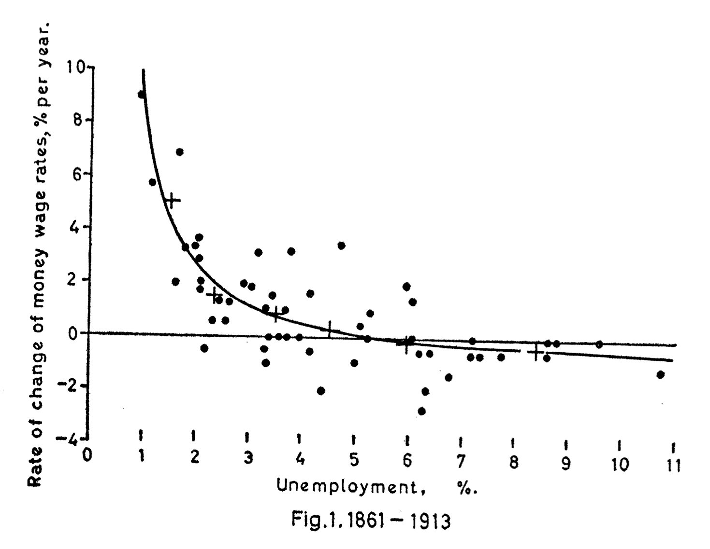

```{r setup}
#| include: false
options(htmltools.dir.version = FALSE)
library(pacman)
p_load(tidyverse, scales, gapminder, ggiraph, patchwork, kableExtra, TSstudio,
       fontawesome, readxl, ggplot2, plotly, ggthemes, ggforce, viridis, knitr, hrbrthemes, ggeasy, ggrepel)
# Knitr options
opts_chunk$set(
  comment = "#>",
  fig.align = "center",
  fig.height = 7,
  fig.width = 10.5,
  warning = F,
  message = F,
  dpi=300
)

theme_set(theme_ipsum_rc())
```

## Antes de empezar

**Se requiere leer**

-   [Curva de Phillips](https://www.econlowdown.org/v3/public/inflation-expectations-the-phillips-curve-and-the-feds-dual-mandate)

-   [Core economics](https://www.core-econ.org/the-economy/v1/book/es/text/15.html).

<br>

::: fragment
### Si le gusta la historia en general:
:::

-   [`Datos de la CIA`](https://www.cia.gov/the-world-factbook/)

## Para hoy

-   Mezclamos **decisiones de política** (inflación y desempleo)
-   Aprendemos mas de [teoría]{.bg style="--col: #FFFF00"} con el asunto de la curva de Phillips
-   Hacemos una comparación en el [tiempo]{.under} para la economía de EEUU
-   Entender los planes de `inflación objetivo`
-   Prepararnos para la politica monetaria

# Empecemos {background-image="images/nature1.jpg"}

## Intercambio

-   Para la población en general e incluso para los mismos *economistas*, esto es muy deseable:

::: fragment
> Un nivel muy bajo de inflación y una tasa de desempleo baja
:::

-   Sin embargo, ocurre lo contrario:

-   Cuando la inflación $\downarrow$, entonces el desempleo $\color{red}{\uparrow}$, es alto o tiende a crecer y viceversa.

    -   Por qué cree que pasa esto?

-   El nivel deseable de que ambas **tasas** sean [bajas]{.alert} siempre es un [problema]{.bg style="--col: #FFFF00"} complejo.

## Intercambio

::: fragment
### Entonces, como balanceamos eso?
:::

-   La [política]{.oranger} es quien puede **intentar** resolver en parte ese problema

-   Pensemos en algo, para re-elegir políticos o partidos políticos. El indicador de empleabilidad es [clave]{.under}. Si en un pasado queda una sensación de [desempleo]{.alert}, entonces ese partido y sus afines no va ser reelegido.

-   En muchas ocasiones -*no es camisa de fuerza*-, el primer periodo de un nuevo gobierno sufre de un [desempleo]{.alert} moderadamente $\triangle \uparrow$ (alto)

-   Colombia es un país donde el empleo tiene mucho que ver con el [estado]{.bg style="--col: #FFFF00"}.

-   Mientras que la [inflación]{.under} sea [estable]{.alert}, importa mas el **empleo**

## Intercambio

::: fragment
```{r, dev='svg', fig.height=1.5, fig.width=5}
#| echo: false
#| message: false
#| warning: false


datos <- data.frame(
  desempleo = c(13.6084, 15.4225, 12.5583, 11.9539, 10.2722, 11.84025816, 9.923435534, 10.77305815, 11.31215274, 11.2264, 10.0677, 9.9404, 8.6473, 9.0375, 8.8227, 9.0971, 8.9122, 9.9891, 9.9497, 13.9142, 11.09649307, 10.27267877, 10.0137174, 10.021132, 8.9001345),
  año = c(2001, 2002, 2003, 2004, 2005, 2006, 2007, 2008, 2009, 2010, 2011, 2012, 2013, 2014, 2015, 2016, 2017, 2018, 2019, 2020, 2021, 2022, 2023, 2024, 2025),
  presidente = c('Pastrana', 'Uribe I', 'Uribe I', 'Uribe I', 'Uribe I', 'Uribe II', 'Uribe II', 'Uribe II', 'Uribe II', 'Santos I', 'Santos I', 'Santos I', 'Santos I', 'Santos II', 'Santos II', 'Santos II', 'Santos II', 'Duque', 'Duque', 'Duque', 'Duque', 'Petro', 'Petro','Petro','Petro')
)

datos$desempleo <- round(datos$desempleo, 2)

p <- ggplot(datos, aes(x = año, y = desempleo, fill = presidente)) +
  geom_bar(stat = "identity") +
  labs(x = "Año", y = "Tasa de Desempleo (%)", 
       title = "Desempleo en Colombia por Año y Presidente") + 
  theme_classic() +
  theme(
    axis.text.x = element_text(angle = 45, hjust = 1, size = 10),
    legend.position = "bottom",
    plot.title = element_text(size = 14, face = "bold")
  )

ggplotly(p, tooltip = c("x", "y", "fill"))


```
:::

# Curva de Phillips {background-image="images/treescape.jpg"}

## Curva de Phillips

:::::: fragment
::::: columns
::: {.column width="60%"}
-   A. W. Phillips (1958), encontró una relación existente entre la [inflación]{.blut} y el [desempleo]{.alert}
-   Vió que [altas]{.blut} tasas de desempleo están relacionadas con [baja]{.bg style="--col: #FFFF00"} inflación
-   Esa [relación]{.under} es conocida como [Curva de Phillips]{.slater}
:::

::: {.column width="40%"}

:::
:::::
::::::

## Curva de Phillips

::: fragment
```{r phillips, out.width='70%', fig.asp=.75, fig.align='center', echo=FALSE}

```
:::

## Curva de Phillips

-   La cantidad de [inflación]{.alert} adicional que se obtiene por una aceleración de un punto en el [crecimiento del PIB]{.under}, o una caída de un punto en el desempleo, depende de:

    -   Los valores actuales de las variables;

    -   Del periodo histórico del país;

    -   Y de lo largo que sea ese periodo.

## Curva de Phillips

```{r, echo=FALSE, message=FALSE, warning=FALSE}
data <- read_csv('datagroup.csv')
red_pink <- "#e64173"
met_slate <- "#23373b"
grey_mid <- "grey50"
red <- "#E02C05"
turquoise <- "#20B2AA"

##== Split data into three periods: 1948-1970, 1970-2000, and 2000-2020:
data_filter1 <- data %>% filter(DATE <= 1970)
data_filter2 <- data %>% filter(DATE >= 1970 & DATE <= 2000)
data_filter3 <- data %>% filter(DATE >= 2000)
##== Create a new column (CPI_CHANGE):
data_filter2 <- data_filter2 %>% mutate(CPI_CHANGE = c(NA, diff(CPI)))
```

```{r, echo=FALSE, message=FALSE, warning=FALSE, dev='svg', fig.height = 5.5}
data %>% 
  ggplot(aes(y=CPI, x=UNRATE)) + 
  geom_point(shape = 24, fill = red_pink,
             color = red_pink, size=2) +
  geom_hline(yintercept = 0, lty=2) +
  labs(title = 'Curva de Phillips: US, 1948–2021 (Santeti, 2023)',
       y = 'Tasa de Inflación (%)',
       x = 'Tasa de desempleo (%)') +
  easy_y_axis_title_size(13) +
  easy_x_axis_title_size(13)
```

## Curva de Phillips

```{r, echo=FALSE, message=FALSE, warning=FALSE, dev='svg', fig.height=5.5}
data %>% 
  ggplot(aes(y=CPI, x=UNRATE)) + 
  geom_point(shape = 24, fill = red_pink,
             color = red_pink, size=2) +
  geom_smooth(se=F) +
  geom_hline(yintercept = 0, lty=2) +
  labs(title = 'Curva de Phillips: US, 1948–2021 (Santeti, 2023)',
       y = 'Tasa de Inflación (%)',
       x = 'Tasa de desempleo (%)') +
  easy_y_axis_title_size(13) +
  easy_x_axis_title_size(13)

```

## Curva de Phillips

-   En algunos casos no siempre se da, p.e:

::: fragment
```{r, echo=FALSE, message=FALSE, warning=FALSE, dev='svg', fig.height=5.5}
data %>% 
  filter(DATE <= 1980) %>% 
  ggplot(aes(x = DATE, y = CPI)) +
  geom_line() +
  geom_point() +
  labs(x = "",
       y = "% cambio en IPC hace un año",
       title = "Tasa de inflación: US, 1948–1980",
       subtitle= "Gráfico de Santeti(2023)") +
  easy_y_axis_title_size(13) 
```
:::

-   La [inflación]{.alert} es bastante inestable!!

## Curva de Phillips

-   El nivel general de precios no dejó de aumentar durante la década de 1970.

-   Cuando la [inflación]{.alert} aumenta de forma constante a lo largo del tiempo, los trabajadores empiezan a incorporar este [contexto inflacionista]{.under} en las [negociaciones salariales]{.bg style="--col: #00FFFF"}.

-   ¡Las [expectativas]{.blut} importan!

-   ¿Y cómo responden los [propietarios]{.oranger} de las empresas al aumento de las demandas salariales?

-   Subiendo los [precios de venta]{.slater}.

# Salarios Reales vs Salarios Nominales {background-image="images/treescape.jpg"}

## Salarios Reales

-   En una [Economía]{.blut}, muchas veces creemos que como el salario [nominal]{.under} crece $\color{red}{\uparrow}$ pensamos que nuestra [riqueza]{.slater} aumenta.

-   El salario [nominal]{.under} tiene un poder de compra o alcanza para cierta cesta de bienes. *Es de pensar que si con 1 millon de salario le alcanzaba para comprar 30 bienes*. Si al pasar los años su salario aumenta en un 19%, es decir, ahora tiene 1 millon 190 mil y solo le alcanza para comprar 26 bienes. Usted en términos [reales]{.bg style="--col: #FFFF00"} ha perdido salario.

-   El Salario real entonces no es mas que:

::: fragment
$$\text{Salario Real}=\dfrac{\text{Salario Nominal}}{\text{IPC}}$$
:::

-   Note que si la [inflación]{.blut} es alta usted se siente mas pobre que antes

## Salarios Reales

-   Un ejemplo de calculo es el siguiente:

::: fragment
```{r, echo=F}
real <- tibble(
  "Años" = c(2021, 2022, 2023, 2024, 2025),
  "Salario Nominal" = c(7000, 7200, 7500, 7590, 7700),
  "IPC" = c(98, 100, 102, 108, 114),
)
real <- real %>%
  mutate(Real = `Salario Nominal` / IPC *100)
  
real %>% 
  kable()
```
:::

## Salarios Reales

-   Las [empresas]{.oranger} fijan sus [precios de mercado]{.alert} en función de los costos de producción, más un [margen de beneficio]{.slater} compatible con la obtención de beneficios.

-   Al mismo tiempo, las empresas intentan pagar [salarios nominales]{.under} coherentes con sus objetivos de beneficios, pero suficientes para mantener motivados a los trabajadores.

-   Además, los [trabajadores]{.bg style="--col: #FFFF00"} negocian cada año su salario objetivo.

-   Cuanto más [poder de mercado]{.alert} tiene una empresa, más puede cobrar por sus bienes y/o servicios.

    -   El resultado es un salario real [decreciente]{.under}.
    -   Y cuanto más organizados estén los trabajadores (a través de los sindicatos y otras instituciones y políticas del mercado laboral), más podrán negociar mejores salarios nominales (y, en consecuencia, mejores salarios reales).

# Nairu {background-image="images/treescape.jpg"}

## Non-Accelerating Inflation Rate of Unemployment

```{r, echo=FALSE, message=FALSE, warning=FALSE, dev='svg', fig.height=5.5}
data_filter2 %>% ggplot(aes(y=CPI_CHANGE, x=UNRATE)) + 
  geom_point(shape = 24, fill = red_pink, color = red_pink, size=2) +
  theme_ipsum_rc() + geom_hline(yintercept = 0) +
  labs(title = 'Curva de Phillips Acelerada, US, 1970–2000',
       y = 'Cambio en la tasa de inflación (%)',
       x = 'Tasa de Desempleo (%)') +
  easy_y_axis_title_size(13) +
  easy_x_axis_title_size(13)

```

## Non-Accelerating Inflation Rate of Unemployment

```{r, echo=FALSE, message=FALSE, warning=FALSE, dev='svg', fig.height=5.5}
data_filter2 %>% ggplot(aes(y=CPI_CHANGE, x=UNRATE)) + 
  geom_point(shape = 24, fill = red_pink, color = red_pink, size=2) +
  geom_smooth(formula = 'y ~ x', method = 'lm', se = FALSE, color = turquoise) +
  theme_ipsum_rc() + geom_hline(yintercept = 0) +
  labs(title = 'Curva de Phillips Acelerada, US, 1970–2000',
       y = 'Cambio en la tasa de inflación (%)',
       x = 'Tasa de Desempleo (%)') +
  easy_y_axis_title_size(13) +
  easy_x_axis_title_size(13)

```

## Non-Accelerating Inflation Rate of Unemployment

-   Este es un concepto que brindan los [datos empíricos]{.bg style="--col: #FFFF00"}, se desprende que se puede alcanzar un determinado [nivel de desempleo]{.alert} compatible con una tasa de [inflación invariable]{.under} a lo largo del tiempo.

-   Por ello, los economistas empezaron a aceptar la noción de una [tasa natural de desempleo]{.oranger}.

-   Esta tasa también se conoce como [tasa de desempleo sin aceleración de la inflación]{.slater} (NAIRU).

## Non-Accelerating Inflation Rate of Unemployment

```{r, echo=FALSE, message=FALSE, warning=FALSE, dev='svg', fig.height=5.5}
years2 <- c("2001", "2007", "2008", "2009", "2019", "2020", "2021")
data_filter3 %>%
  mutate(CPI_CHANGE = c(NA, diff(CPI))) %>% 
  ggplot(aes(y=CPI_CHANGE, x=UNRATE, label = ifelse(DATE %in% years2, DATE, ""))) + 
  geom_point(shape = 24, fill = red_pink, color = red_pink, size=2) +
  geom_text_repel(family = 'Roboto Condensed', size = 4.5) +
  geom_smooth(formula = 'y ~ x', method = 'lm', se = FALSE, color = turquoise) +
  theme_ipsum_rc() + geom_hline(yintercept = 0) +
  labs(title = 'Curva de Phillips Acelerada, US, 2000–2021',
       y = 'Cambio en la tasa de inflación (%)',
       x = 'Tasa de desempleo (%)') +
  easy_y_axis_title_size(13) +
  easy_x_axis_title_size(13)
```

## Bibliografía

`r fa('book')` Udayan R. (2022) *Introduction to Macroeconomics*. Bookdown

`r fa('book')` Shapiro D., MacDonald D. & Greenlaw S. A., (2024)*Principles of Macroeconomics 3e: Official OpenStax*. OpenStax

`r fa('book')` Santetti M., (2023) Lecture notes Course *Introduction to Macroeconomics*. MIMEO

##  {background-image="images/road01.jpg"}

### Gracias por su atención!! {.r-fit-text}

#### cayanes\@uninorte.edu.co

#### [carlosyanes.netlify.app](https://carlosyanes.netlify.app/)
