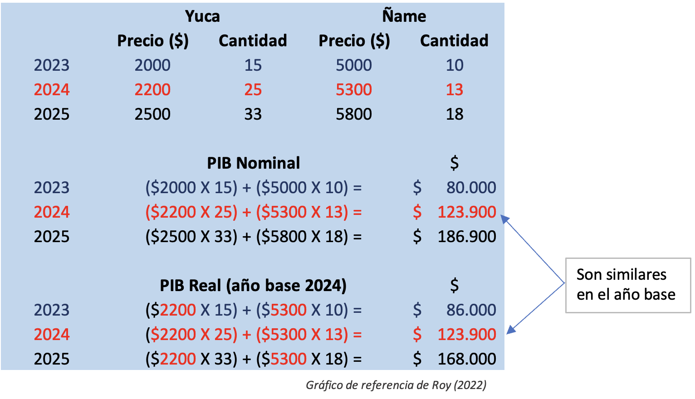
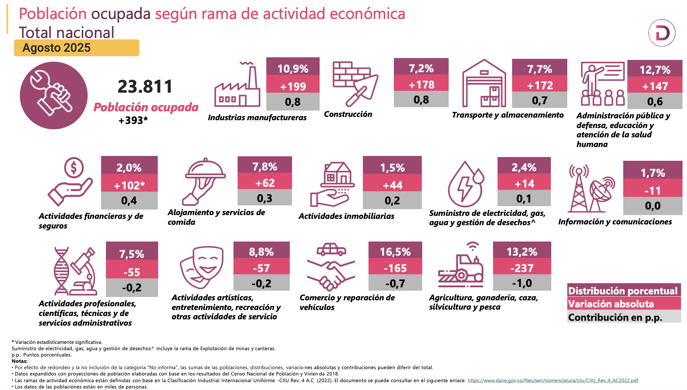

```{r setup}
#| include: false
library(pacman)
p_load(tidyverse, scales, gapminder, ggiraph, patchwork, kableExtra, TSstudio, fontawesome, readxl, ggthemes, xaringanExtra, ggdag, viridis, knitr, dslabs, gapminder, extrafont, Ecdat, tidyverse, magrittr, janitor, kableExtra, plotly, ggeasy, ggrepel)
# Colores
red_pink <- "#e64173"
met_slate <- "#272822" # metropolis font color 
purple <- "#9370DB"
green <- "#007935"
light_green <- "#7DBA97"
orange <- "#FD5F00"
turquoise <- "#44C1C4"
# knitr options
opts_chunk$set(
  comment = "#>",
  fig.align = "center",
  fig.height = 7,
  fig.width = 10.5,
  #dpi = 300,
  #cache = T,
  warning = F,
  message = F
)  
theme_simple <- theme_bw() + theme(
  axis.line = element_line(color = met_slate),
  panel.grid = element_blank(),
  rect = element_blank(),
  strip.text = element_blank(),
  text = element_text(family = "Fira Sans", color = met_slate, size = 17),
  axis.text.x = element_text(size = 12),
  axis.text.y = element_text(size = 12),
  axis.ticks = element_blank()
)
theme_market <- theme_bw() + theme(
  axis.line = element_line(color = met_slate),
  panel.grid = element_blank(),
  rect = element_blank(),
  strip.text = element_blank(),
  text = element_text(family = "Fira Sans", color = met_slate, size = 17),
  axis.title.x = element_text(hjust = 1, size = 17),
  axis.title.y = element_text(hjust = 1, angle = 0, size = 17),
  # axis.text.x = element_text(size = 12),
  # axis.text.y = element_text(size = 12),
  axis.ticks = element_blank()
)
theme_gif <- theme_bw() + theme(
  axis.line = element_line(color = met_slate),
  panel.grid = element_blank(),
  rect = element_blank(),
  text = element_text(family = "Fira Sans", color = met_slate, size = 17),
  axis.text.x = element_text(size = 12),
  axis.text.y = element_text(size = 12),
  axis.ticks = element_blank()
)
wrapper <- function(x, ...) paste(strwrap(x, ...), collapse = "\n")
shift_axis <- function(p, y=0){
  g <- ggplotGrob(p)
  dummy <- data.frame(y=y)
  ax <- g[["grobs"]][g$layout$name == "axis-b"][[1]]
  p + annotation_custom(grid::grobTree(ax, vp = grid::viewport(y=1, height=sum(ax$height))), 
                        ymax=y, ymin=y) +
    geom_hline(aes(yintercept=y), data = dummy, size = 0.5, color = met_slate) +
    theme(axis.text.x = element_blank(), 
          axis.ticks.x = element_blank())
}
#xaringanExtra::use_scribble()

# budget line (for graphing)
budget <- function(x, wage, non_labor_income) {
  wage * (24 - x) + non_labor_income
}

# utility function = u(x, y) = C (x - A)^a (y - B)^(1-a)
utility <- function(x, y, constant = 1, alpha = 0.5, offset = 10) {
  if (offset == 0) {
    utility <- constant * (x ^ alpha) * (y ^ (1 - alpha))
  } else {
    utility <-
      constant * ((x - 1 / offset) ^ alpha) * ((y - 1 / offset) ^ (1 - alpha))
  }
  return(utility)
}

# optimal leisure hours
optimize <-
  function(non_labor_income = 0,
           wage = 4,
           alpha = 0.5,
           offset = 10) {
    if (offset == 0) {
      marginal_utility <-
        function(x) {
          ((1 - alpha) / alpha) * wage * x
        }
    } else {
      marginal_utility <- function(x) {
        (offset * x * wage + wage - alpha * (offset * x * wage + wage + 1)) / (offset * alpha)
      }
    }
    
    budget <- function(x) {
      wage * (24 - x) + non_labor_income
    }
    
    optimal_x <-
      uniroot(function(x)
        budget(x) - marginal_utility(x), c(-100, 100))$root
    
    if (optimal_x > 24) {
      optimal_x <- 24
    }
    
    return(optimal_x)
  }

# indifference curve (k = utility level)
ic <- function(x, k, constant = 1, alpha = 0.5, offset = 10) {
  if (offset == 0) {
    ic <- (k / (constant * x ^ alpha)) ^ (1 / (1 - alpha))
  } else {
    ic <- ((k * (x - 1/offset) ^ (-alpha)) / constant) ^ (1 / (1 - alpha)) + 1/offset
  }
  return(ic)
}

# not accurate enough for offset != 0
ic_slope <- function(x, k, constant = 1, alpha = 0.5, offset = 10) {
  if (offset == 0) {
    ic_slope <- alpha * ((k * x ^ (-alpha)) / constant) ^ (1 / (1 - alpha)) / ((alpha - 1) * x)
  } else {
    ic_slope <- alpha * offset * ((k * (x - 1/offset) ^ (-alpha)) / constant) ^ (1 / (1 - alpha)) / ((alpha - 1) * (offset * x - 1))
  }
  return(ic_slope)
}

```

## Qué vamos hacer en esta clase

- Aspectos Macroeconómicos
- Inflación
- Producto Interno Bruto
- Paridad en indices para bienestar (PPP)
- Algo de Politica de Empleo


## Aspectos Macroecómicos

::: .incremental

- El [entorno macroeconómico]{.fg style="--col: #e64173"} es el conjunto de **condiciones** y **variables** que describen el estado general de la economía de un país o región en un momento determinado. Incluye aspectos como el *crecimiento del PIB*, *la inflación*, *la tasa de interés*, *el tipo de cambio*, *el empleo*, *la balanza comercial*, la [política fiscal]{.bg style="--col: #00FFFF"} y la [política monetaria]{.bg style="--col: #FFFF00"}.

- En términos simples, es el “clima” económico donde los proyectos se **formulan**, financian, ejecutan y evalúan. Así como el clima atmosférico influye en una cosecha, el clima macroeconómico influye en la [viabilidad]{.fg style="--col: #0000FF"} y [rentabilidad]{.fg style="--col: #0000FF"} de un proyecto.
:::

## Aspectos Macroecómicos

- Todo proyecto —sea público o privado— implica una asignación de recursos hoy esperando beneficios futuros.

- Esos [beneficios]{.fg style="--col: #e64173"}
 y [costos]{.fg style="--col: #e64173"}
 no ocurren en un vacío, sino en un contexto económico que:
	-	Determina el **costo del dinero** (tasas de interés o costo de capital).
	-	Afecta los **precios de insumos** y **mano de obra** (inflación, productividad).
	-	Condiciona la demanda esperada (ciclo económico, poder adquisitivo).
	-	Incide sobre los riesgos y la rentabilidad esperada (devaluación, recesión, políticas públicas).
	
##  {background-image="images/bean.jpg"}

### Tasas de Interés y Costo del Financiamiento {.r-fit-text}

## Tasas de interés
::: fragment
Una subida en las tasas de interés tiene el **efecto directo de aumentar el costo de financiamiento** para los proyectos de inversión. Esto sucede porque:
- Los préstamos se hacen más caros debido a la mayor tasa que deben pagar los [inversionistas]{.fg style="--col: #e64173"}.
- Los proyectos que dependen de financiamiento externo (bancos, inversionistas, emisiones de bonos) ven cómo sus costos de **capital** se incrementan.
:::

:::: fragment
::: callout-warning
### Tasa de interés: 
**Porcentaje** que se cobra (o paga) por el uso del dinero prestado o invertido en un período de tiempo.

$$Pago= \text{dinero} \times (1+i)$$
:::
::::

## Efecto en los Proyectos de Inversión

- Una subida en las tasas de interés tiene el **efecto directo de aumentar el costo de financiamiento** para los proyectos de inversión. 

- En este ejemplo, un proyecto de inversión de $10,000,000 requiere financiamiento a largo plazo.

::: fragment
#### Supuestos Iniciales:
- **Tasa de interés inicial**: 8% anual.
- **Préstamo solicitado**: $8,000,000.
- **Duración**: 10 años.
:::

## Efecto en los Proyectos de Inversión

#### Costo de Financiamiento Original

::: fragment
$$\text{Pago Anual} = \frac{\text{Préstamo} \times \text{Tasa}}{1 - (1 + \text{Tasa})^{-10}} = \frac{8,000,000 \times 0.08}{1 - (1 + 0.08)^{-10}} = 1,070,829.45$$
:::

::: fragment
**Flujo de caja anual de pago**: $1,070,829.45
:::

## Efecto en los Proyectos de Inversión

#### **Escenario con Subida en la Tasa de Interés:**

::: fragment
Supongamos que la tasa de interés sube al **10%**.

$$\text{Nuevo Pago Anual} = \frac{8,000,000 \times 0.10}{1 - (1 + 0.10)^{-10}} = 1,152,788.22$$

:::

::: fragment
**Flujo de caja anual de pago**: $1,152,788.22
:::

## Efecto en los Proyectos de Inversión

::: fragment
**Diferencia en el Costo:**
- **Aumento en el pago anual**: $1,152,788.22 - $1,070,829.45 = **$81,958.77**
:::

::: fragment
**Impacto en la Rentabilidad del Proyecto:**
- La subida de 2 puntos porcentuales aumenta el costo de financiamiento en aproximadamente **$81,958.77** anuales, lo que reduce la [rentabilidad]{.fg style="--col: #e64173"} de cualquier proyecto, y por lo tanto su **VAN** o **TIR**.
:::

## Efecto en los Proyectos de Inversión

:::: {.columns}

::: {.column width="40%"}

:::

::: {.column width="60%"}
Según el PMBOK (Project Management Body of Knowledge), los proyectos están influenciados por los llamados Factores Ambientales de la Empresa (Enterprise Environmental Factors, EEFs), que incluyen:

	- Condiciones económicas nacionales o internacionales.
	- Políticas gubernamentales y regulatorias.
	- Tendencias del mercado financiero y laboral.
	- Tipos de cambio y acceso a financiamiento.

El [gerente de proyectos]{.bg style="--col: #FFFF00"} debe identificar y analizar estos factores al inicio del proyecto, porque pueden modificar la línea base de *tiempo*, *costo* y *alcance*.
:::

::::

## Referentes (indicadores)

-   Es [muy importante]{.bg style="--col: #FFFF00"} que siempre este mirando los indicadores económicos.
-   Una fuente muy importante es la de distintos diarios del país y entonces ir viendo si no es *día* a *día* si al menos a la semana.
-   Una pagina de este **estilo** es por ejemplo: [Indicadores diarios](https://www.larepublica.co/indicadores-economicos/macro)

:::: fragment
::: callout-warning
En el caso para inflación hay que tener en cuenta:

-   Variación mensual
-   Variación doce meses
-   Variación año corrido
:::
::::

## Primeros cálculos

-   Hay múltiples formulas que encontrará en el [DANE](https://www.dane.gov.co/index.php/estadisticas-por-tema/precios-y-costos/indice-de-precios-al-consumidor-ipc/ipc-informacion-tecnica)

:::: fragment
::: callout-important
## Variación Mensual (VM)

<font size="+2">$$\text{VM}=\left[\frac{\text{IPC mes referencia}}{\text{IPC mes anterior}}-1\right]\times 100$$</font>
:::
::::

## Primeros cálculos

-   Para la parte anual (gran componente de la parte de inflación)

:::: fragment
::: callout-note
## Variación Anual (VA)

<font size="+2">$$\text{VA}=\left[\frac{\text{IPC mes referencia}}{\text{IPC mismo mes año anterior}}-1\right]\times 100$$</font>
:::
::::

:::: fragment
::: callout-note
## Variación Año Corrido (VAC)

<font size="+2">$$\text{VAC}=\left[\frac{\text{IPC mes referencia}}{\text{IPC mes diciembre año anterior}}-1\right]\times 100$$</font>
:::
::::

## Efecto inflación

::: fragment
Supongamos que estamos evaluando un **proyecto de construcción de una planta** que requiere una inversión inicial y generará flujos de caja durante los próximos 5 años. En este caso, la [inflación]{.fg style="--col: #FF8000} afecta tanto los costos de los insumos como las ventas proyectadas (dependiendo de la elasticidad del precio).
:::

::: fragment
Datos del Proyecto:

- Inversión inicial: $5,000,000
- Vida útil del proyecto: 5 años
- Inflación anual: 5% (inflación constante)
- Tasa de descuento nominal: 10% (que incluye inflación y riesgo del proyecto)
:::

## Efecto inflación

::: fragment
| Año  | Flujo de Caja Nominal |
|------|-----------------------|
| Año 1 | $1,200,000            |
| Año 2 | $1,300,000            |
| Año 3 | $1,400,000            |
| Año 4 | $1,500,000            |
| Año 5 | $1,600,000            |
:::

:::: fragment
Para obtener los [flujos reales]{.fg style="--col: #0000FF"}, necesitamos ajustar los *flujos nominales* para [eliminar]{.fg style="--col: #e64173"} el efecto de la inflación. Usamos la fórmula:

::: callout-note
## Ajuste de flujos
$$\text{Flujo Real} = \frac{\text{Flujo Nominal}}{(1 + \text{Inflación})^t}$$
:::
::::

## Efecto inflación

::: fragment
$$\text{Flujo Real (Año 1)} = \frac{1,200,000}{(1 + 0.05)^1} = \frac{1,200,000}{1.05} = 1,142,857.14$$
:::

::: fragment
$$\text{Flujo Real (Año 2)} = \frac{1,300,000}{(1 + 0.05)^2} = \frac{1,300,000}{1.1025} = 1,179,253.07$$
:::

:::fragment
### Y así continua...
:::


## Efecto inflación

::: fragment
| Año  | Flujo de Caja Nominal | Flujo de Caja Real |
|------|-----------------------|--------------------|
| Año 1 | 1,200,000            | $1,142,857.14      |
| Año 2 | 1,300,000            | $1,179,253.07      |
| Año 3 | 1,400,000            | $1,208,116.95      |
| Año 4 | 1,500,000            | $1,235,332.27      |
| Año 5 | 1,600,000            | $1,254,907.59      |
:::

::: fragment
Vamos al cálculo del VAN

$$\text{VAN Nominal} = \frac{1,200,000}{(1 + 0.10)^1} + \frac{1,300,000}{(1 + 0.10)^2} + \frac{1,400,000}{(1 + 0.10)^3} + \frac{1,500,000}{(1 + 0.10)^4} + \frac{1,600,000}{(1 + 0.10)^5}$$

$$\text{VAN Nominal} = 1,090,909 + 1,074,380 + 1,050,103 + 1,026,486 + 1,003,606 = 5,245,484$$
:::

## Efecto inflación

::: fragment
$$\text{VAN Real} = \frac{1,142,857}{(1 + 0.10)^1} + \frac{1,179,253}{(1 + 0.10)^2} + \frac{1,208,116}{(1 + 0.10)^3} + \frac{1,235,332}{(1 + 0.10)^4} + \frac{1,254,907}{(1 + 0.10)^5}$$
:::

::: fragment
Tambien su parte
$$\text{VAN Real} = 1,038,962 + 975,049 + 902,115 + 821,581 + 737,016 = 4,474,723$$
:::

::: fragment
- La [inflación]{.bg style="--col: #FFFF00"} reduce el VAN real del proyecto, ya que *los flujos de caja* ajustados por inflación tienen un menor valor en términos de **poder adquisitivo constante**.

- Aunque los [flujos nominales]{.bg style="--col: #00FFFF"} muestran un VAN más alto, los flujos reales proporcionan una visión **más precisa** de la [rentabilidad real]{.fg style="--col: #e64173"} del proyecto, considerando el poder adquisitivo a lo largo del tiempo.
:::

##  {background-image="images/bean.jpg"}

### Otros indicadores Macroeconómicos {.r-fit-text}

## Recuerde algo

:::: fragment
::: callout-note
## Con lo microeconómico

Se mira la forma en que los individuos (hogares) y empresas toman decisiones, así como la forma en la que interactúan con los mercados locales
:::
::::

::: fragment
[Ejemplo: ¿Qué sucede si disminuye los impuestos para autos importados?]{.bg style="--col: #dcdcdc"}
:::

:::: fragment
::: callout-tip
## Con lo macroeconómico

Se mira los fenómenos que afectan a la economía como un todo: desempleo, crecimiento económico, entre otros
:::
::::

::: fragment
[Ejemplo: ¿Qué sucede si el gobierno aumenta la inversión en infraestructura física?]{.bg style="--col: #dcdcdc"}
:::

::: fragment
Microeconomía → [macroeconomía]{.fg style="--col: #FF0000"} → microeconomía
:::

## Comparación entre ramas

### Qué preguntas hace la Macroeconomía?

-   ¿Por qué los ingresos han experimentado un rápido crecimiento en los últimos cien años en algunos países mientras que otros siguen sumidos en la [pobreza]{.fg style="--col: #FF8000"}?

-   ¿Por qué algunos países tienen tasas de inflación elevadas mientras que otros mantienen estables los [precios]{.fg style="--col: #FF8000"}?

-   ¿Por qué todos los países experimentan [recesiones]{.fg style="--col: #FF8000"} y [depresiones]{.fg style="--col: #314f4f"} –es decir, periodos recurrentes de disminución de los ingresos y de aumento del desempleo – cómo pueden reducir los gobiernos su frecuencia y su gravedad?

## Déficit público y deuda: por qué importan en los proyectos

::::{.columns}
::: {.column width="70%"}
[Déficit público]{.bg style="--col: #00FFFF"}: ocurre cuando el gasto del Estado supera sus ingresos en un periodo.

$$\text{Déficit} = \text{Gasto Público} - \text{IngresosFiscales}$$

- [Deuda pública]{.bg style="--col: #00FFFF"}: es la acumulación de déficits pasados financiados mediante crédito interno o externo.
:::

::: {.column width="30%"}
<iframe src="https://ourworldindata.org/grapher/gross-public-sector-debt-as-a-proportion-of-gdp?tab=map" loading="lazy" style="width: 100%; height: 400px; border: 0px none;" allow="web-share; clipboard-write"></iframe>
:::
::::

## Déficit público y deuda: por qué importan en los proyectos

::: fragment
#### Ambos son indicadores macroeconómicos críticos porque:

- Determinan la capacidad del **Estado** para financiar infraestructura, subsidios o incentivos.
- Influyen en las [tasas de interés]{.fg style="--col: #0000FF"}, la [inflación]{.fg style="--col: #0000FF"} y el [riesgo país]{.fg style="--col: #0000FF"}, que afectan el costo del dinero.
- Señalan la sostenibilidad fiscal del entorno donde los proyectos se desarrollan.
:::

::: fragment
> Se calcula comúnmente como la diferencia (spread) entre la tasa de interés de los bonos soberanos de un país y los Bonos del Tesoro de EE.UU. (considerados "libres de riesgo")


:::


## Déficit público y deuda: por qué importan en los proyectos
::::{.columns}
::: {.column width="70%"}
| **Categoría**       | **Monto (billones de COP)** | **% del Total**           |
|----------------------|-----------------------------|---------------------------|
| Inversión pública    | 99,9                        | 19,9%                     |
| Funcionamiento       | 402,7                       | 80,1%                     |
| Deuda pública *(incluye servicio de deuda)* | 403,3 | — |
| **Total**            | **502,6**                   | **100%**                  |
:::


::: {.column width="30%"}
- El país recauda vía **ingreso tributario** y no tributario la suma de 281.5 billones de pesos.
_ La ejecución de 2024 llegó a ser de un 83.1%
:::
::::

## Déficit público y deuda: por qué importan en los proyectos


::: fragment
| **Componente**                       | **% Aprox.** | **Valor Aprox. (COP/galón)** |
|-------------------------------------|---------------|-------------------------------|
| Ingreso al Productor                | 60–65%        | 10.772                        |
| Transporte & Márgenes               | 5–8%          | 800–1.100                     |
| Impuestos Nacionales (IVA + IC)     | 20–25%        | 3.500–4.000                   |
| Sobretasa Municipal                 | 3–5%          | 500–800                       |
| Impuesto al Carbono                 | 1–2%          | 200–300                       |
| Ajuste FEPC                         | 0–5%          | Variable (subsidio leve)      |
| **Total**                           | **100%**      | **16.293**                    |
:::


## Hablemos mas de la Deuda

:::: fragment
::: callout-note
La **deuda pública** es el conjunto de obligaciones financieras contraídas por el Gobierno Nacional Central (GNC) —y en algunos casos, entidades territoriales o empresas estatales— para cubrir déficits fiscales, invertir en infraestructura o responder a emergencias. No es "deuda personal" del ciudadano, sino una herramienta del Estado para equilibrar sus finanzas.
:::
::::

::: fragment
#### Tipos principales:
- **Deuda interna**: Emitida en pesos colombianos (ej. Títulos de Tesorería - TES), comprada por inversionistas locales (bancos, fondos de pensiones). Representa ~70-75% del total.

- **Deuda externa**: En dólares o euros, emitida en mercados internacionales (bonos soberanos). aprox. 25-30% del total, más sensible a fluctuaciones cambiarias.
:::


##  {background-image="images/arb.jpg"}

### Agregados {.r-fit-text}

## Agregados Nacionales

-   Los economistas utilizan las [estadísticas agregadas]{.fg style="--col: #FF0000"} para describir los fenómenos macroeconómicos.

-   Aquí, agregado significa simplemente [suma]{.bg style="--col: #FFFF00"}.

-   Entre ellos, el Producto Interno Bruto (PIB) es la principal medida de los [resultados económicos globales]{.fg style="--col: #0000FF"} y del tamaño de un país.

-   Se define como la [suma]{.bg style="--col: #FFFF00"} (en valor monetario) de todos los bienes y servicios finales producidos en una economía en un periodo determinado. Como lo describe la economista Diane Coyle:

::: fragment
> Desde uñas a cepillos de dientes, tractores, zapatos, cortes de pelo, asesoría de empresas, limpieza de calles, enseñanza del yoga, planchas, vendas, libros y los millones de servicios y productos de la economía.
:::

## Evolución PIB {.r-fit-text}

[PIB](https://fred.stlouisfed.org/series/COLNAEXKP01STSAQ)

## Evolución PIB

-   Una distinción crucial en Economía es entre valores [reales]{.bg style="--col: #FFFF00"} y [nominales]{.bg style="--col: #FFFF00"}.

-   En el caso del PIB, esto es especialmente importante cuando la [inflación]{.bg style="--col: #FFFF00"} es un componente tan importante de la economía.

-   La inflación es un aumento sostenido del [nivel de precios]{.fg style="--col: #0000FF"} de una economía.

-   El valor **nominal** de cualquier medida económica implica una estadística en términos de [precios reales]{.fg style="--col: #FF0000"} que existen en ese momento.

-   En cambio, los [valores reales]{.fg style="--col: #FF0000"} se refieren a la misma estadística una vez ajustada a la inflación.

## PIB

::: fragment
$$
\begin{aligned}
\text{PIB} \ = \text{Consumo + Inversión + Gasto Público + Exportaciones netas}
\end{aligned}
$$
:::

<br>

::: fragment
$$
\begin{aligned}
\text{PIB} = C + I + G + (X - M)
\end{aligned}
$$
:::

## PIB

::: fragment
```{r, echo=FALSE}
toy <- tibble(
  "Años" = c(2015, 2016, 2017),
  "Precio Corriente (por unidad)" = c(1.00, 1.10, 1.15),
  "Cantidad Vendida" = c(200, 250, 230),
  "PIB Nominal" = c(200, 275, 264.5)
)  
  
toy %>% 
  kable()
```
:::

::: fragment
Clave la distinción de lo nominal. Si queremos entonces tener el **REAL** necesitamos un año base.
:::

## PIB

-   Supongamos que nuestro año base es [2016]{.bg style="--col: #FFFF00"}

::: fragment
```{r, echo=F}
toy2 <- tibble(
  "Años" = c(2015, 2016, 2017),
  "Precio Constante (por unidad)" = c(1.10, 1.10, 1.10),
  "Cantidad Vendida" = c(200, 250, 230),
  "PIB Real" = c(220, 275, 253)
)  
  
toy2 %>% 
  kable()
```
:::

## Comparación

::: fragment
```{r, echo=F}
toy3 <- tibble(
  "PIB Nominal" = c(200, 275, 264.5),
  "PIB Real (Precios Constantes de 2016)" = c(220, 275, 253)
)  
  
toy3 %>% 
  kable()
```
:::

-   Podemos entonces tener a consideración

::: fragment
$$
\begin{aligned}
\text{PIB Real} = \dfrac{\text{PIB Nominal}}{\text{Deflactor PIB}}
\end{aligned}
$$
:::

-   Una vista [Gráfica](https://fred.stlouisfed.org/series/COLNAGIGP01IXOBSAQ)

## PIB

-   Antes de continuar... debemos tener presente la [importancia]{.bg style="--col: #FFFF00"} de conocer porque es necesario tener un [Indice de precios]{#FF8000 .fg style="\"--col:"}

-   Un [índice]{.fg style="--col: #FF8000"} es un número que permite realizar [comparaciones]{.fg style="--col: #FF0000"} entre distintos momentos del tiempo o distintas entidades.

-   Para nuestros efectos, un [índice de precios]{.fg style="--col: #FF8000"} es un número de referencia que nos permite comparar estadísticas económicas en distintos momentos, sirviendo como cambio medio global de los [precios relativos]{.fg style="--col: #e64173"} a lo largo del tiempo.

-   Teniendo en cuenta que el [tiempo]{.under}, la cantidad de bienes y servicios producidos por una economía aumenta, y también lo hacen sus [precios]{.fg style="--col: #e64173"}.

-   Para ello, el [deflactor del PIB]{.under} es un índice de precios que incluye todos los bienes y servicios que se contabilizan en el [PIB]{#FF8000 .fg style="\"--col:"} mediante una metodología de **media ponderada**.

## PIB

::::: columns
::: {.column width="30%"}
-   El PIB Nominal no tiene en cuenta la variación de precios
-   El PIB Real si lo hace, aparte nos muestra en pleno cuanto realmente hemos [crecido]{.under}
-   Siempre en el [año base]{.under} tanto el PIB nominal como el Real serán **similares**
:::

::: {.column width="70%"}
```{r pib-cas1, fig.cap='Calculo de PIB Real y Nominal', out.width='100%', fig.asp=.75, fig.align='center', echo=FALSE}

```
:::
:::::

## PIB

<iframe src="https://fred.stlouisfed.org/graph/graph-landing.php?g=1gYXq&amp;width=670&amp;height=475" scrolling="no" frameborder="0" style="overflow:hidden; width:670px; height:525px;" allowTransparency="true" loading="lazy">

</iframe>

## PIB

Considere los siguientes datos (en Billones de US\$) para EEUU, entre Q1 2008 and Q4 2009 (año base = 2005) y halle el [PIB real]{.bg style="--col: #9f9f9f"} correspondiente:

```{r, echo=F}
pib_real <- tibble(
  "Trimestre" = c("Q1 2008", "Q2 2008", "Q3 2008", "Q4 2008", "Q1 2009", "Q2 2009", "Q3 2009", "Q4 2009"),
  "PIB Nominal" = c(14373.9, 14497.8, 14546.7, 14347.3, 14178.0, 14151.2, 14242.1, 14453.8), 
  "PIB Real" = c(13366.9, 13415.3, 13324.6, 13141.9, 12925.4, 12901.5, 12973.0, 13149.5)
)

pib_real <- pib_real %>% 
  mutate("Deflactor PIB" = `PIB Nominal`/`PIB Real`)

pib_real %>% 
  select(-`PIB Real`) %>% 
  kable(digits = 2)
```

## PIB

-   Miremos la relación existente entre el [deflactor]{.blut} y la propia [inflación]{.oranger} (IPC)

::: fragment
```{r, echo=FALSE}
# Crear el data frame con los datos proporcionados
datos <- data.frame(
  fecha = 2000:2020,
  Deflactor = c(33.66, 6.52, 5.97, 6.82, 7.28, 4.76, 5.80, 5.21, 7.68, 4.05, 
                3.81, 6.39, 3.62, 1.90, 2.24, 2.45, 5.15, 5.14, 4.63, 4.00, 1.41),
  Inflacion = c(8.75, 7.65, 6.99, 6.49, 5.5, 4.85, 4.48, 5.69, 7.67, 2.00,
                3.17, 3.73, 2.44, 1.94, 3.66, 6.77, 5.75, 4.09, 3.18, 3.8, 1.61)
)

# Convertir la columna de fechas en un objeto de serie de tiempo
datos$fecha <- as.Date(paste0(datos$fecha, "-01-01"))  # Convertir a formato fecha
serie_tiempo <- ts(datos[, -1], start = c(2000), frequency = 1)  # Crear la serie de tiempo excluyendo la columna de fechas
# Asignar nombres a las columnas
colnames(serie_tiempo) <- colnames(datos[, -1])
# Mostrar el objeto de serie de tiempo
# print(serie_tiempo)

ts_plot(serie_tiempo,
         title = "Inflación vs Deflactor PIB en Colombia", 
         Ytitle = "Crecimiento porcentual (%)", 
         slider = FALSE
 )
```
:::

##  {background-image="images/Polwave2.jpg"}

### Ingreso total {.r-fit-text}

## Ingreso total

-   Necesitamos medir la [salud de una economía]{.bg style="--col: #FFFF00"}. A la hora de juzgar si una economía va bien o mal, es natural fijarse en el [ingreso total]{.oranger} que obtienen sus habitantes.

-   El [ingreso total]{.oranger} no siempre está estrechamente ligado al [bienestar económico]{.alert}. Por ejemplo, la población de un país puede aumentar temporalmente su nivel de vida [pidiendo prestado]{.under} a otros países. -*Pero no se puede seguir pidiendo prestado para siempre*-. Por eso, el nivel de vida de una nación depende en gran medida de su propia renta total.

::: fragment
### Ingreso = Gasto = Producción {.r-fit-text}
:::

## Ingreso total

-   Podríamos medir tanto el [ingreso total]{.oranger} como el [gasto total]{.alert} o la [producción total]{.bg style="--col: #FFFF00"}. Obtendríamos la misma cifra en todos los casos.

-   Para una economía en su conjunto, el [ingreso]{.oranger} debe ser igual al gasto porque:

::: fragment
> Cada transacción tiene un comprador y un vendedor.
:::

-   Cada peso (\$) de gasto de algún comprador es un peso de ingreso para algún vendedor.

-   Además, el gasto total es también el [valor monetario]{.alert} de la producción que se produce y se vende.

-   Esta [igualdad]{.under} entre ingresos, gastos y producción tiene consecuencias prácticas. Ofrece a los estadísticos gubernamentales más opciones sobre cómo medir el [ingreso total]{.oranger}.

## Ingreso total

-   [P]{.alert}: ¿Y el *ahorro*? La gente suele ahorrar parte de lo que gana. ¿Cómo es posible entonces que el [ingreso]{.oranger} sea igual al [gasto]{.alert} en el conjunto de la economía?

-   [*R/*]{.blut}: Lo que la gente ahorra suele prestarse a [las empresas]{.under}, que luego **gastan** el dinero prestado. Por tanto, para el conjunto de la economía, los ingresos deben seguir siendo iguales a los gastos.

## Ingreso total

-   [P]{.alert}: ¿Y el comercio internacional? Compramos bienes fabricados en el extranjero y los [extranjeros]{.blut} compran bienes fabricados por nosotros. En ese caso, ¿cómo pueden nuestros [ingresos totales]{.oranger} ser iguales a nuestros gastos totales?

-   [*R/*]{.blut}: Así es. Por tanto, es mejor decir que el [ingreso total]{.oranger} de los residentes nacionales es igual al gasto total en bienes y servicios de producción nacional.

## Ingreso total

-   El Producto Interno Bruto (PIB) es una medida del [ingreso total]{.oranger} de un país. Existen otras medidas del [ingreso total]{.oranger}, pero el PIB es la más popular.

-   El [PIB]{.alert} es el valor total de mercado de todos los bienes y servicios finales producidos en un país en un periodo de tiempo determinado.

-   No se trata de un concepto *teórico abstracto*. Podemos ponerle una cifra. Por ejemplo, el PIB de Colombia en 2023 fue de 978 250 miles de millones de pesos (978 Billones), según el Departamento Nacional de Estadística DANE. (Para más datos, consulta [esto](https://www.dane.gov.co/files/operaciones/PIB/cp-PIB-IVtrim2023.pdf)).

## Ingreso en finales

-   El PIB mide el valor de los [bienes finales]{.bg style="--col: #FFFF00"}, no de los bienes intermedios.

-   Los [bienes intermedios]{.under} son aquellos bienes que desaparecen dentro de otros bienes que se producen para la venta. Los [bienes finales]{.blut} son bienes que no son intermedios. Son bienes vendidos a sus usuarios finales. El PIB se define de forma que el valor de los bienes intermedios se contabilice una sola vez, no dos o tres veces.

-   Los bienes intermedios son bienes que sus productores venden a los productores de otros bienes. Ejemplos:

    -   Leche vendida por una central lechera a una empresa de helados,
    -   Uvas vendidas por un viñedo a un vinicultor,
    -   papel de impresora vendido a Norma.

## Ingreso en finales

-   Los bienes finales son los que se venden a los usuarios finales de esos bienes. Ejemplos:

    -   Leche que compras en un supermercado,
    -   Uvas de mesa que compras en el mercado del agricultor,
    -   Papel de impresora que compra para la impresora de su computador.

-   Todos los bienes fabricados [este año]{.under} pero que **no** se han vendido a final de año se consideran bienes finales (y se etiquetan como "existencias").

-   *Nota*: Aunque los [servicios]{.alert} de su Broker, que dedica su tiempo a negociar acciones para usted, se contabilizan en el PIB, el comercio de activos en sí no afecta al PIB. ¿Por qué? Este comercio no es más que la transferencia de la propiedad de un activo de una persona a otra.

##  {background-image="images/Polwave2.jpg"}

### Valor Agregado {.r-fit-text}

## Valor Agregado

-   Mire una especie de contabilidad en el PIB con enfoque de Valor Agregado:

::: fragment
```{r, echo=FALSE}
vito <- tibble(
  "Procesos" = c("Agricultor siembra trigo y vende a comercio en $", "Comercio transforma trigo en harina y vende a $", "Panadero hace pan con harina y vende a $"),
  "Compra" = c(100, 300, 480),
  "Valor agregado" = c(100, 200, 180)
)  
vito %>% 
  kable()
```
:::

-   Note que:

::: fragment
$$\text{PIB}=100+200+180=\color{red}{480}$$
:::

-   La [suma de valor agregado]{.under} es el **PIB** cuando por ejemplo el solo panadero como venta final ha vendido a \$480 su producto.

##  {background-image="images/Polwave2.jpg"}

### PIB per Cápita {.r-fit-text}

## PIB per Cápita

-   Cuando individualizamos el **PIB** dividiendoel PIB sobre el [tamaño de la población]{.bg style="--col: #FFFF00"} vamos encontrar lo que se denomina [PIB per cápita]{.oranger}:

::: fragment
$$
\begin{aligned}
\text{PIB} \ per \ cápita = \dfrac{\text{PIB Nominal o Real}}{\text{Población}}
\end{aligned}
$$
:::

-   Así que si en Colombia el PIB es de 978 Billones de pesos, el *PIB per capita* viene a ser:

::: fragment
$$\text{PIB per cápita}_{Col}=\frac{978 \ \text{Billones}}{53 \ \text{Millones}}=18 \;452\;830$$
:::

## PIB per Cápita

-   Sirve para comparar entre países y nos da idea de como un País es mas rico que otro. Tomemos por ejemplo: Japón y Colombia.

-   [Purchasing Power Parity (PPP)]{.bg style="--col: #FFFF00"} una forma para homologar que lo que se consume en cierto sitio también se hace en otro.

:::: fragment
::: callout-note
## PPP

$$\begin{aligned}
\text{Tasa de cambio PPP}=\dfrac{\text{Precio del bien en moneda local}}{\text{Precio del bien en moneda extranjera}}
\end{aligned}$$
:::
::::

## PIB per Cápita

-   Suponga que un (1) peso colombiano en octubre de 2025 equivale a 0.039 YENES
    -   Así que, la **tasa de cambio** YEN/COP es de 25.41, cuando (1) YEN se iguala a COP.

:::: fragment
::: callout-note
## Tasa de cambio

Aquella que expresa el valor de una moneda en términos de otra
:::
::::

## PIB per Cápita

-   Resolviendo el PIB en términos de YENES:

::: fragment
$$\begin{aligned}
\text{PIB COLOMBIA en Yen\$} = \dfrac{\text{PIB COL en COP}}{\text{tasa de cambio Yen/Pesos}} = \dfrac{978 \; \text{Billones de pesos}}{25.41 \; \text{pesos}}
\end{aligned}$$
:::

-   Esto nos da $\text{Yen(\$)}= \; 38.48 \; \text{Billones de Yenes}$

-   Con dolares nos da: $\text{Dolar(\$)}= \; 251.99 \; \text{Mil millones de dolares}$

-   Lo que es en téminos de [PIB per cápita]{.alert} un total de 4.716 US Dolares.

- Note que uno puede armar una tabla por los países a comparar

## PIB per Cápita

```{r, message=FALSE,echo=FALSE, warning=FALSE, dev='svg'}
# Paquetes
library(WDI)
library(tidyverse)
library(ggthemes)

# 1️⃣ Descargar datos del Banco Mundial
paises <- c("CO", "US", "DE", "FR", "CH", "ES", "IT", "GB", "MX", "BR", "CL", "AR", "PE")
pib_df <- WDI(country = paises, indicator = "NY.GDP.PCAP.CD", start = 2023, end = 2023)

# 2️⃣ Limpiar datos
pib_df <- pib_df %>%
  select(country, NY.GDP.PCAP.CD) %>%
  rename(PIB_percapita = NY.GDP.PCAP.CD) %>%
  mutate(
    grupo = case_when(
      country %in% c("United States", "Germany", "France", "Switzerland", "Spain", "Italy", "United Kingdom") ~ "Desarrollado",
      TRUE ~ "En vía de desarrollo"
    ),
    country = recode(country,
      "Colombia" = "Colombia",
      "United States" = "EE.UU.",
      "Germany" = "Alemania",
      "France" = "Francia",
      "Switzerland" = "Suiza",
      "Spain" = "España",
      "Italy" = "Italia",
      "United Kingdom" = "Reino Unido",
      "Mexico" = "México",
      "Brazil" = "Brasil",
      "Chile" = "Chile",
      "Argentina" = "Argentina",
      "Peru" = "Perú"
    )
  )

# 3️⃣ Gráfico de barras
pib_df %>%
  ggplot(aes(x = reorder(country, PIB_percapita), y = PIB_percapita, fill = grupo)) +
  geom_col(width = 0.7) +
  geom_text(aes(label = paste0("$", format(round(PIB_percapita, 0), big.mark = ","))),
            vjust = -0.5, size = 4) +
  scale_y_continuous(labels = scales::comma) +
  scale_fill_manual(
    "Nivel de desarrollo",
    values = c("Desarrollado" = "#0077b6", "En vía de desarrollo" = "#90e0ef")
  ) +
  labs(
    title = "PIB per cápita (USD, 2023)",
    subtitle = "Comparación entre Colombia y otros países seleccionados",
    x = "Países",
    y = "PIB per cápita (USD)",
    caption = "Fuente: Banco Mundial (WDI, 2023)"
  ) +
  ggthemes::theme_pander(base_size = 15) +
  theme(
    legend.position = "bottom",
    plot.title = element_text(face = "bold"),
    axis.text.x = element_text(angle = 20, hjust = 1)
  )
```

##  {background-image="images/Polwave2.jpg"}

### Indice Big Mac {.r-fit-text}

## 🍔 ¿Qué es el Índice Big Mac?

::: fragment
El **Índice Big Mac** es una medida creada por *The Economist* para [comparar]{.blut} el **poder adquisitivo** entre países.
:::

::: fragment
Se basa en el precio de una [hamburguesa Big Mac]{.alert} en distintas monedas.
:::

:::: fragment
::: {.callout-tip}
## Idea principal:
Si un Big Mac cuesta más caro en un país que en otro (ajustado por tipo de cambio),  
entonces una moneda está **sobrevalorada** o **subvalorada** frente al dólar.
:::
::::

## 🍔 ¿Qué es el Índice Big Mac?

::: fragment
- Precio del Big Mac en **Colombia**: **$16,900 COP**  
- Precio del Big Mac en **EE.UU.**: **$5.69 USD**
- Tipo de cambio de mercado: **$3,950 COP/USD**
:::

:::fragment
$$\text{Tipo de cambio implícito (PPA)} = \frac{16,900}{5.69} = 2,970 \text{ COP/USD}$$
:::

::: fragment
$$\text{Subvaloración del peso} = \frac{2,970 - 3,950}{3,950} \times 100 = -24.8\%$$
:::

::: fragment
El peso colombiano estaría **subvalorado en 25%** frente al dólar según el [Índice Big Mac]{.alert}.
:::

## 🍔 ¿Qué es el Índice Big Mac?

::: fragment
```{r, echo=FALSE, message=FALSE, warning=FALSE}
library(ggplot2)
library(dplyr)

# Datos simulados con nuevos países
bigmac <- data.frame(
  pais = c("EE.UU.", "Colombia", "Chile", "México", "Brasil", "China", "Rusia", "Suiza"),
  precio_local = c(5.69, 16900, 5100, 89, 23, 25.9, 229, 6.9),
  moneda = c("USD", "COP", "CLP", "MXN", "BRL", "CNY", "RUB", "CHF"),
  tipo_cambio = c(1, 3950, 930, 16, 5.2, 7.1, 92, 0.86)
)

# Calcular tipo de cambio PPA y diferencia
bigmac <- bigmac %>%
  mutate(
    ppa = precio_local / 5.69,
    sobreval = (ppa - tipo_cambio) / tipo_cambio * 100
  )

# Gráfico
ggplot(bigmac, aes(x = reorder(pais, sobreval), y = sobreval, fill = pais)) +
  geom_col(width = 0.7) +
  geom_text(aes(label = paste0(round(sobreval, 1), "%")),
            vjust = -0.5, size = 4) +
  scale_fill_brewer(palette = "Blues") +
  theme_minimal(base_size = 14) +
  labs(
    title = "Índice Big Mac: Comparación de monedas frente al USD",
    subtitle = "Valores negativos indican subvaloración de la moneda",
    x = "País",
    y = "Diferencia (%)",
    caption = "Fuente: The Economist (Big Mac Index 2024)"
  ) +
  theme(legend.position = "none")
```
:::


##  {background-image="images/Polwave2.jpg"}

### Empleo {.r-fit-text}

## Determinantes del desempleo

::: fragment
```{r, echo=FALSE, results='asis'}
cat("
| **Concepto**              | **Valor (COP)** | **Jornada**                                |
|----------------------------|-----------------|--------------------------------------------|
| Salario mínimo mensual     | $1.423.500      | 48 horas semanales, 8 horas diarias        |
| Salario mínimo diario      | $47.450         | Jornada ordinaria (diurna)                 |
| Salario mínimo hora        | $6.189          | 6 A.M. – 9 P.M.                            |
| Salario mínimo nocturna    | $8.025          | 9 P.M. – 6 A.M.                            |
| Auxilio de transporte mensual | $200.000     | 48 horas semanales, 8 horas diarias        |
| Auxilio de transporte diario  | $6.667        | Jornada ordinaria                         |
")
```
:::

## Determinantes del desempleo

::: fragment
```{r unemployment03, fig.cap='Tabla de ocupaciones', out.width='80%', fig.asp=.75, fig.align='center', echo=FALSE}

```
:::

## Determinantes del desempleo

::: fragment
> Existen un grupo de **variables que inciden** en la existencia y persistencia del desempleo.
:::

-   Salarios en otros mercados laborales
-   Ingresos no laborales
-   Preferencias sobre trabajo y ocio
-   Condiciones de trabajo
-   Prestaciones complementarias
-   Número de trabajadores cualificados

# Miremos mas preguntas

## Pregunta 1

Si le dan la siguiente información

```{r, echo=FALSE}
vate <- tibble(
  "Datos ciudad" = c("Población total", "Población adulta", "Desocupados", "Fuerza Laboral"),
  "Valores" = c(6000, 4000, 200, 2000 )
)  
vate %>% 
  kable()
```

Cuál es la tasa de desempleo?

> A. El 10% <br> B. El 20% <br> C. El 40% <br> D. El 50%

## Pregunta 1 {visibility="uncounted"}

Si le dan la siguiente información

```{r, echo=FALSE}
vate <- tibble(
  "Datos ciudad" = c("Población total", "Población adulta", "Desocupados", "Fuerza Laboral"),
  "Valores" = c(6000, 4000, 200, 2000 )
)  
vate %>% 
  kable()
```

Cuál es la tasa de desempleo?

> [A. El 10%]{.alert} <br> B. El 20% <br> C. El 40% <br> D. El 50%

## Pregunta 2

Carlos perdió su trabajo en la fabrica de vidrios porque la economía cayó en recesión. Podemos clasificarlo como:

> A. Desempleado temporal <br> B. Desempleado friccional <br> C. Desempleado estructural <br> D. Desempleado cíclico

## Pregunta 2 {visibility="uncounted"}

Carlos perdió su trabajo en la fabrica de vidrios porque la economía cayó en recesión. Podemos clasificarlo como:

> A. Desempleado temporal <br> B. Desempleado friccional <br> C. Desempleado estructural <br> [D. Desempleado cíclico]{.alert}

## Pregunta 3

Hay un requerimiento alto en la Guajira de Ingenieros Mecánicos. Maria es ingeniera mecánica anda desempleada pero vive en Barranquilla. Entra a ser clasificada como:

> A. Desempleado temporal <br> B. Desempleado friccional <br> C. Desempleado estructural <br> D. Desempleado cíclico

## Pregunta 3 {visibility="uncounted"}

Hay un requerimiento alto en la Guajira de Ingenieros Mecánicos. Maria es ingeniera mecánica anda desempleada pero vive en Barranquilla. Entra a ser clasificada como:

> A. Desempleado temporal <br> B. Desempleado friccional <br> [C. Desempleado estructural]{.alert} <br> D. Desempleado cíclico

## Pregunta 4

No es cierto que el desempleo pueda llegar a cero (o caer tan bajo), porque existe:

> A. Impuestos corporativos <br> B. Desempleo friccional <br> C. Desempleo cíclico <br> D. Políticas gubernamentales

## Pregunta 4 {visibility="uncounted"}

No es cierto que el desempleo pueda llegar a cero (o caer tan bajo), porque existe:

> A. Impuestos corporativos <br> [B. Desempleo friccional]{.alert} <br> C. Desempleo cíclico <br> D. Políticas gubernamentales

##  {background-image="images/Plantis.jpg"}

### Implicaciones de politica {.r-fit-text}

## La politica de empleabilidad

-   En un mundo que depronto sea [igual]{.bg style="--col: #FFFF00"} seguira siendo **desigual**, esto es porque simplemente tenemos todos preferencias [distintas]{.alert}

    -   No se trata de que no se pueda reducir
    -   Hay niveles sociales de convencimiento
    -   Los ingresos mayores podrán conducir al mundo a mejorar preferencias

-   Lo que ha dicho el gobierno

::: fragment
> "El Estado actuará como empleador de última instancia ofreciendo empleo a quienes puedan y quieran trabajar, pero no encuentran empleo en el sector privado, beneficiando principalmente a las y los desempleados, jóvenes, mujeres, trabajadores informales, las economías populares y los territorios"
:::

##  {background-image="images/Polwave2.jpg"}

### Politica y empleo {.r-fit-text}

## Intercambio

-   Para la población en general e incluso para los mismos *economistas*, esto es muy deseable:

::: fragment
> Un nivel muy bajo de inflación y una tasa de desempleo baja
:::

-   Sin embargo, ocurre lo contrario:

-   Cuando la inflación $\downarrow$, entonces el desempleo $\color{red}{\uparrow}$, es alto o tiende a crecer y viceversa.

    -   Por qué cree que pasa esto?

-   El nivel deseable de que ambas **tasas** sean [bajas]{.alert} siempre es un [problema]{.bg style="--col: #FFFF00"} complejo.

## Intercambio

::: fragment
### Entonces, como balanceamos eso?
:::

-   La [política]{.oranger} es quien puede **intentar** resolver en parte ese problema

-   Pensemos en algo, para re-elegir políticos o partidos políticos. El indicador de empleabilidad es [clave]{.under}. Si en un pasado queda una sensación de [desempleo]{.alert}, entonces ese partido y sus afines no va ser reelegido.

-   En muchas ocasiones -*no es camisa de fuerza*-, el primer periodo de un nuevo gobierno sufre de un [desempleo]{.alert} moderadamente $\triangle \uparrow$ (alto)

-   Colombia es un país donde el empleo tiene mucho que ver con el [estado]{.bg style="--col: #FFFF00"}.

-   Mientras que la [inflación]{.under} sea [estable]{.alert}, importa mas el **empleo**

## Intercambio Político

::: fragment
```{r, dev='svg', echo=FALSE}
# ===============================================
# 📊 Desempleo en Colombia por año y presidente
# ===============================================

library(ggplot2)
library(dplyr)
library(ggthemes)
library(plotly)

# Datos
datos <- data.frame(
  desempleo = c(13.6084, 15.4225, 12.5583, 11.9539, 10.2722, 11.84025816, 9.923435534, 10.77305815, 11.31215274, 11.2264,
                10.0677, 9.9404, 8.6473, 9.0375, 8.8227, 9.0971, 8.9122, 9.9891, 9.9497, 13.9142, 11.09649307,
                10.27267877, 10.0137174, 9.10),
  año = c(2001, 2002, 2003, 2004, 2005, 2006, 2007, 2008, 2009, 2010,
          2011, 2012, 2013, 2014, 2015, 2016, 2017, 2018, 2019, 2020,
          2021, 2022, 2023, 2024),
  presidente = c('Pastrana', 'Uribe I', 'Uribe I', 'Uribe I', 'Uribe I',
                 'Uribe II', 'Uribe II', 'Uribe II', 'Uribe II',
                 'Santos I', 'Santos I', 'Santos I', 'Santos I',
                 'Santos II', 'Santos II', 'Santos II', 'Santos II',
                 'Duque', 'Duque', 'Duque', 'Duque',
                 'Petro', 'Petro', 'Petro')
)

# Limpieza
datos$desempleo <- round(datos$desempleo, 2)

# Paleta personalizada por presidente
colores_presidente <- c(
  "Pastrana" = "#5dade2",
  "Uribe I" = "#2e86c1",
  "Uribe II" = "#1f618d",
  "Santos I" = "#82e0aa",
  "Santos II" = "#27ae60",
  "Duque" = "#f5b041",
  "Petro" = "#e74c3c"
)

# Gráfico mejorado
p <- ggplot(datos, aes(x = factor(año), y = desempleo, fill = presidente)) +
  geom_col(width = 0.8) +
  geom_text(aes(label = paste0(desempleo, "%")),
            vjust = -0.3, size = 3.8, color = "black") +
  scale_fill_manual(values = colores_presidente) +
  scale_y_continuous(expand = expansion(mult = c(0, 0.1))) +
  labs(
    title = "📉 Tasa de Desempleo en Colombia (2001–2024)",
    subtitle = "Desglose anual según periodo presidencial",
    x = "Año",
    y = "Tasa de desempleo (%)",
    fill = "Presidente",
    caption = "Fuente: DANE – Cálculos propios"
  ) +
  theme_economist_white(base_size = 14) +
  theme(
    axis.text.x = element_text(angle = 45, hjust = 1),
    plot.title = element_text(face = "bold"),
    legend.position = "bottom",
    legend.title = element_text(face = "bold")
  )

# Gráfico interactivo
ggplotly(p)
```
:::

# Salarios Reales vs Salarios Nominales {background-image="images/treescape.jpg"}

## Salarios Reales

-   En una [Economía]{.blut}, muchas veces creemos que como el salario [nominal]{.under} crece $\color{red}{\uparrow}$ pensamos que nuestra [riqueza]{.slater} aumenta.

-   El salario [nominal]{.under} tiene un poder de compra o alcanza para cierta cesta de bienes. *Es de pensar que si con 1 millon de salario le alcanzaba para comprar 30 bienes*. Si al pasar los años su salario aumenta en un 19%, es decir, ahora tiene 1 millon 190 mil y solo le alcanza para comprar 26 bienes. Usted en términos [reales]{.bg style="--col: #FFFF00"} ha perdido salario.

-   El Salario real entonces no es mas que:

::: fragment
$$\text{Salario Real}=\dfrac{\text{Salario Nominal}}{\text{IPC}}$$
:::

-   Note que si la [inflación]{.blut} es alta usted se siente mas pobre que antes

## Salarios Reales

-   Un ejemplo de calculo es el siguiente:

::: fragment
```{r, echo=F}
real <- tibble(
  "Años" = c(2021, 2022, 2023, 2024, 2025),
  "Salario Nominal" = c(7000, 7200, 7500, 7590, 7700),
  "IPC" = c(98, 100, 102, 108, 114),
)
real <- real %>%
  mutate(Real = `Salario Nominal` / IPC *100)
  
real %>% 
  kable()
```
:::

## Salarios Reales

-   Las [empresas]{.oranger} fijan sus [precios de mercado]{.alert} en función de los costos de producción, más un [margen de beneficio]{.slater} compatible con la obtención de beneficios.

-   Al mismo tiempo, las empresas intentan pagar [salarios nominales]{.under} coherentes con sus objetivos de beneficios, pero suficientes para mantener motivados a los trabajadores.

-   Además, los [trabajadores]{.bg style="--col: #FFFF00"} negocian cada año su salario objetivo.

-   Cuanto más [poder de mercado]{.alert} tiene una empresa, más puede cobrar por sus bienes y/o servicios.

    -   El resultado es un salario real [decreciente]{.under}.
    -   Y cuanto más organizados estén los trabajadores (a través de los sindicatos y otras instituciones y políticas del mercado laboral), más podrán negociar mejores salarios nominales (y, en consecuencia, mejores salarios reales).

## Bibliografía

`r fa('book')` Udayan R. (2022) *Introduction to Macroeconomics*. Bookdown

`r fa('book')` Shapiro D., MacDonald D. & Greenlaw S. A., (2024)*Principles of Macroeconomics 3e: Official OpenStax*. OpenStax

`r fa('book')` Santetti M., (2023) Lecture notes Course *Introduction to Macroeconomics*. MIMEO

##  {background-image="images/tit1.jpg"}

### Gracias por su atención!! {.r-fit-text}

#### cayanes\@uninorte.edu.co

#### [carlosyanes.netlify.app](https://carlosyanes.netlify.app/)
